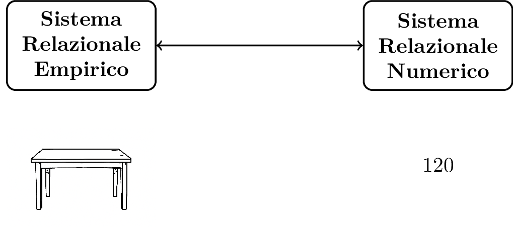
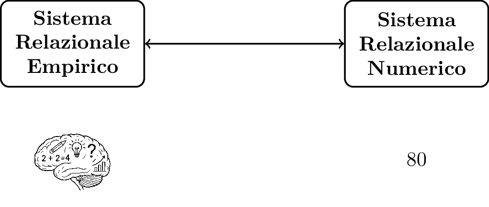

# Psicometria per la neuropsicologia clinica {#psicometria-per-la-neuropsicologia-clinica}

## Perché è importante misurare?
Un intero capitolo dedicato alla misurazione non può che partire da una definizione di misurazione, per quanto generale: _La misurazione è l'utilizzo di numeri per descrivere delle entità di interesse_. La definizione di misurazione in ambito neuropsicologico sarà il tema del [prossimo paragrafo](#misurazione_e_neuropsicologia_clinica), in cui approfondiremo molto questo argomento. 
Le _entità di interesse_ della misurazione in neuropsicologia sono di diverso tipo, ma il più delle volte sono funzioni cognitive, come attenzione o memoria

Per misurare utilizziamo i **test** cioè specifici strumenti di misurazione sviluppati appositiamente in ambito psicologico e neuropsicologico. Anche i test saranno oggetto di un [paragrafo dedicato](#i-test)

Prima di cominciare con questi approfondimenti è importante soffermarsi su una domanda fondamentale: _Perchè è importante misurare?_ Non possiamo dare per scontato che sia una cosa necessaria o indispensabile e anzi, è utile riflettere sull'utilità di utilizzare numeri per descrivere qualcosa.

La misurazione è innanzitutto considerata una delle basi del metodo scientifico e un approccio scientifico e basato dall'evidenza, non può che passare dalla misurazione. Un celebre aforisma (probabilmente apocrifo) di Galileo Galilei, uno dei padri del metodo scientifico è: _misura ciò che puoi misurare, rendi misurabile ciò che non lo è_ .  Anche ogni libro che parli di epistemologia, cioè la filosofia della scienza, tende ad avere un capitolo o una sezione sulla misurazione, a sostegno di quanto sia fondamentale per il processo sicientifico (es. `Boniolo & Vidali, 1999`{=html}). In breve quindi:

_misurare in neuropsicologia clinica ci permette di adottare un approccio scientifico e andare oltre la semplice osservazione clinica qualitativa_

Fermiamoci adesso un attimo a riflettere su quale è lo scopo di una valutazione neuropsicologica. Lo scopo potrebbe essere l'accertamento sul sospetto di una patologia in corso (es. un sospetto di demenza, sospetto di ADHD), o la caratterizzazione di un disturbo cognitivo in una condizione accertata (es. capire se un trauma cranico ha avuto delle conseguenze). Le informazioni possono avere fini diagnostici, prognostici, o di monitoraggio longitudinale. Nel caso di monitoraggio longitudinale questo in genere è effettuato per investigare il decorso di una patologia nel tempo o per valutare l'effetto di un trattamento riabilitativo.
La misurazione è utile perchè ci permette dunque di avere più informazioni rilevanti per la valutazione neuropsicologica e di risultati più _oggettivi_[^1].

[^1]: per _oggettivo_ indichiamo un risultato che non è dipendente da chi sta effettuando l'esame.

Un ulteriore e importante aspetto è che utilizzare punteggi permette di crare una sorta di _linguaggio comune_ per la discussione di un caso clinico. Oltre ad alcune etichette cliniche diffuse in certi ambiti, come _decadimento cognitivo lieve_, _decadimento cognitivo moderato_, i punteggi ai test rappresentano infatti un'opportunità per comunicare rapidamente lo stato di un'individuo. Per esempio per chi lavora in ambito di disturbi cognitivi nell'ambito delle demenza, dire che un paziente ha un MMSE (MiniMental State Examination) pari a 12, denota senza bisogno di ulteriori dettagli uno stato di decadimento cognitivo piuttosto grave. Questo aspetto verrà approfondito nel corso del libro.

È inoltre importante notare che in alcune branche della psicologia clinica, l'utilizzo di punteggi e la misurazione non sono considerati necessari o fondamentali. Si pensi ad esempio ad approcci come la psicoanalisi, o alcuni approcci costruttivisti alla psicoterapia. Entrambi non fanno quasi uso di strumenti misurazione e i test hanno un ruolo nullo o marginale.
Quando si parla però di neuropsicologia clinica o di di valutazione neuropsicologica, la prima cosa che viene in mente è invece una persona che sta effettuando una serie di test per riuscire a comprendere lo stato cognitivo di un individuo e una serie di punteggi ottenuti da questi test: la misurazione sembra un aspetto imprescindibile. Provando a chiedere a ChatGPT4.0 la seguente cosa _Crea un disegno in bianco e nero di una neuropsicologa che sta effettuando una valutazione neuropsicologica_ il risultato che ho ottenuto (14/09/2025) è la figura qui di seguito: una persona che sta somministrando un test, verosimilmente per misurare qualche aspetto del funzionamento cognitivo della persona esaminata.

{width=60%}

In altre parole, la neuropsicologia clinica come disciplina **assume** e ha come presupposto che la misurazione degli oggetti di interesse (funzionamento cognitivo, rischio di sviluppare una malattia, etc), sia possibile raggiungere delle conclusioni diagnostiche migliori, sia possibile fare delle migliori scelte terapeutiche in generale si svolga una migliore attività clinica (si veda paragrafo [Epistemologia della neuropsicologia clinica](chapters/epistemologia-e-metodologia.qmd) per ulteriori dettagli). 
La misurazione, cioè l'utilizzo di punteggi, ci aiuta a quantificare delle proprietà di interesse e poter fare delle scelte cliniche più precise rispetto al solo utilizzo della osservazione clinica qualitativa e basate su evidenze scientifiche. Il più delle volte questo implica che i punteggi sono confrontati con delle soglie e se i valori sono al di là di queste soglie, viene concluso che il risultato ha rilevanza clinica (useremo più avanti termini più tecnici e definizioni più precise). La persona con il punteggio al di là della soglia potrebbe avere un deficit cognitivo, o forse un rischio di avere una patologia neurodegenerativa o un disturbo del neurosviluppo. 

Va da sé, che se questo è uno dei presupposti della neuropsicologica clinica come disciplina, effettuare correttamente le misurazioni è un primo aspetto fondamentale che determinerà la qualità della nostra attività clinica.

## Cosa misuriamo in neuropsicologia clinica?

La disciplina che si occupa della misurazione in psicologia (e in neuropsicologia) è la _psicometria_, una delle discipline che, insieme alla statistica, rappresentano le fondamenta di questo libro. La psicometria si occupa proprio delle questioni della misurazione in psicologia, una tipologia di misurazione molto particolare perchè non tratta di proprietà di oggetti fisici ma di [**costrutti**](chapters/Appendici/definzioni.qmd#costrutto), cioè concetti psicologici non osservabili.


Il fatto di non essere proprietà non osservabili non è di per sé un problema insormontabile ed è comune in vari campi al di là di quello psicologico. Per esempio, si pensi, al campo magnetico prodotto da un oggetto, o alla sua temperatura.
Nel caso di costrutti per renderlo osservabile ci basiamo sull'osservazione di comportamenti associati al costrutto di interesse. Tali comportamenti sono spesso detti **indicatori** (o proxy in inglese). 

::: {.callout-note}
## Definizione
**Costrutto**:
Un concetto psicologico non direttamente osservabile (in neuropsicologia clinica la misurazione è spesso di costrutti non osservabili come memoria, attenzione, etc.). Per essere osservabile un costrutto è associato a uno o più _indicatori_ spesso comportamenti osservabili, associati al costrutto stesso.
:::

Una caratteristica peculiare della misurazione psicologica è che la relazione tra ciò che è l'esito della misura (cioè il punteggio) e ciò che si vuole misurare, cioè il costrutto, è molto indiretto. <!--(Nota Giorgio: qui si parlava  di numeri e poi la citazione di lezk è su comportamento-->  Nel suo manuale "Neuropsychological Assessment", Muriel Lezak, una delle persone più influenti nella neuropsicologia clinica riporta questo passaggio (di Sivan & Benton, 1999) molto esplicito a riguardo.

_“Le abilità cognitive (e le disabilità) sono proprietà funzionali dell’individuo che non vengono osservate direttamente, ma piuttosto inferite dal comportamento. Ogni comportamento (compresa la performance nei test neuropsicologici) è determinato da molteplici fattori: l’insuccesso di un paziente in una prova di ragionamento astratto può non dipendere da un deficit specifico nel pensiero concettuale, ma da un disturbo dell’attenzione, da una difficoltà verbale o dall’incapacità di discriminare gli stimoli della prova.”_ `(\cite{sivan1999cognitive})`{=latex}`(Sivan & Benton, 1999)`{=html}

In breve. **Non esiste una corrispondenza univoca tra un comportamento e uno specifico aspetto del funzionamento cognitivo (normale o deficitario). Quasi per definizione ogni comportamento è riconducibili a più abilità cognitive**. <!--(Nota Giorgio: aggiungere? altre citazioni qui?) -->

La neuropsicologia, tramite test e misurazione non si occupa però solo di costrutti (intesi come concetti psicologici), ma in alcuni casi di altre entità, come la probabilità di sviluppare una patologia neurologica, la probabilità di sviluppare sintomi comportamentali, o semplicemente la predizione di un altro punteggio. Distinguere questi casi è rilevanti perché alcuni metodi psicometrici o considerazioni statistiche possono valere solo in alcuni di questi casi. Tutte questo sarà comunque approfondito nei paragrafi e capitoli successivi <!-- Aggiungere hyperlink corretti qui -->


## Misurazione e neuropsicologia clinica{#misurazione_e_neuropsicologia_clinica}

Abbiamo già detto come in neuropsicologia clinica somministriamo test per ottenere dei punteggi, cioè dei numeri, che ci aiutano a descrivere ciò che è di interesse che, il più delle volte è legato **costrutti neuropsicologici, psicologici o cognitivi**, quali memoria, attenzione, benessere, depressione, etc. L'utilizzo dei numeri ci aiuta a capire meglio il funzionamento cognitivo cognitivo e capire se, per esempio, per una specifica funzione (es. la memoria) è talmente basso da farci sospettare un deficit oppure l'inizio di una patologia neurodegenerativa. Allo stesso tempo l'avere dei numeri ci permette di avere una stima della capacità in un certo momento per poi tornare ad ripetere la rilevazione e vedere se c'è stato un peggioramento, per esempio dovuto ad un declino, oppure un miglioramento, per esempio dovuto ad un trattamento riabilitativo.  
Ciò che abbiamo descritto sopra non è altro che esempi di _misurazione_ di una proprietà del funzionamento mentale: tramite i test misuriamo la memoria, misuriamo l'attenzione o altre caratteristiche di interesse. 

Finora ci siamo accontentati di una definizione generica di misurazione, ma per una trattazione metodologicamente rigorosa abbiamo bisogno di avere una definizione più precisa di cosa si intenda per _misurare_ . Già qui sorgono i primi problemi. Non esiste infatti una definizione di misurazione unanimamente accettata (questa considerazione sarà proprio il punto di partenza del paragrafo [Introduzione all'Item Response Theory](#introduzione-item-response-theory)), ma esistono delle definizioni molto diffuse e, come vedremo, alcune di queste sono implicitamente utilizzate nella pratica neuropsicologica clinica o forense.


### La definizione di misurazione di S.S. Stevens (1946) e le scale di misura

La più famosa definizione di misurazione è certamente quella di S.S. Stevens, che in un articolo del 1946 ha fornito una definizione che influenzato (nel bene e nel male) la storia della psicologia `(\cite{stevens1946measurement})`{=latex}
`(Stevens, 1946)`{=html}:

::: {.callout-note}
## Definizione
**Misurazione secondo S.S. Stevens**

_"...possiamo dire che la misurazione, nel senso piu ampio, è definita come l’assegnazione di numeri a oggetti o eventi secondo determinate regole.” (p. 667) _

:::

La proposta di Stevens va contestualizzata al clima del momento. Alla fine degli anni quaranta si stava discutendo in ambito scientifico se gli oggetti di interesse della psicologia potessero essere misurati e se, quindi, la psicologia potesse essere considerata una scienza. L'iniziale conclusione di una commissione internazionale di fisici e psicologi che si era riunita per dare una risposta a questa domanda era arrivata alla conclusione che, secondo una definizione rigorosa di misurazione, la risposta era _no_. 
Secondo Stevens però, il problema era proprio nei presupposti della commissione e, più in particolare, nella definizione troppo restrittiva di misurazione. Propose dunque la definizione riportata sopra, e sottolineò che anche se ogni regola porta a misurazione, un aspetto importante (ma separabile) è l'utilizzo che si può fare dei numeri o classificazioni e questo dipende dalla **Scala di misura**. A seconda delle proprietà misurate (ma che possiamo sempre definire come una _misurazione_ ) potrebbe quindi essere diverso l'utilizzo che possiamo fare dei numeri. La proposta di Stevens salvava la psicologia come scienza e anzi aiutava a chiarire l'utilizzo dei numeri per la misurazione in diverse circostanze.


Esistono quattro scale di misura: _categoriale, ordinale, a intervalli, a rapporti_. Queste scale possono essere organizzate gerarchicamente (categoriale al livello più basso, a rapporti al livello più alto), e le operazioni possibili ad un livello più basso sono possibili a tutti i livelli superiori. Per esempio calcolare la mediana è possibile a livello di scala ordinale, ma anche nella scala ad intervalli e a rapporti in quanto più alte nella gerarchia. Da notare che anche il solo rilevare se una persona è femmina o maschio è, secondo la definizione di Stevens, un caso di misurazione, utilizzando una _scala categoriale_. In questo caso non hanno senso operazioni tipo addizione o sottrazione o moltiplicazione (non ha senso dire che una femmina è due volte un maschio o viceversa) e una delle poche operazioni possibili è contare quanti casi abbiamo per ogni categoria (es. confrontare il numero di femmine con il numero di maschi). Un riassunto delle scale e delle operazioni possibili è riportata nella tabella 1.2.


```{=latex}
\begingroup
{\scriptsize
```

| Scala        | Descrizione                                                                 | Esempio                         | Operazioni possibili                                   |
|--------------|------------------------------------------------------------------------------|---------------------------------|--------------------------------------------------------|
| **Nominale** | Classificazione in categorie senza ordine implicito                         | Sesso (M/F), Colori, Nazionalità | Conteggio, moda, verifica uguaglianza/differenza      |
| **Ordinale** | Classificazione con ordine, ma le distanza tra categorie non hanno significato   | Posizione in una classifica, Titolo di studio | Ordinamento, mediane, percentili                     |
| **Intervallo** | Misura con ordine e intervalli uguali, ma senza zero assoluto significativo | Temperatura in °C, IQ           | Addizione, Sottrazione,Media, Deviazione standard, z-score                |
| **Rapporto** | Misura con ordine, intervalli uguali e lo zero ha un significato          |  Età, Scolarità in anni, tempi di reazione | Tutte le operazioni aritmetiche (×, ÷, +, −), z-score, rapporti|
:Tabella 1.2: Le quattro tipologie di scale di misura secondo S.S. Stevens.

**Legenda**  
- *Scala*: tipo di misura secondo la classificazione di Stevens.  
- *Descrizione*: caratteristiche principali della scala.  
- *Esempio*: variabili reali che rientrano in quella scala.  
- *Operazioni possibili*: trasformazioni matematiche e statistiche consentite dai dati.

```{=latex}
}
\endgroup
```

L'idea di avere una definizione di misurazione molto generica, accompagnata ad una distinzione di scale di misura è molto potente e tuttora è molto influente nella misurazione in psicologia. Come anticipato, però, ci sono anche altre definizioni. Nel prossimo paragrafo sarà approfondita una di queste, che entrava in forte contrasto con la proposta di Stevens. <!-- aggiungere che questa definizione non è prima di problemi). -->

## Definizione di Misurazione secondo Suppes & Zinnes (1963)

Un'altra possibile definizione di misurazione, molto celebre in Psicometria è quella di Suppes & Zinnes 

Definiamo qui il _Sistema Relazionale Empirico_, come l'insieme di entità del mondo empirico che hanno una determinata proprietà che vogliamo misurare (es. oggetti di diversa lunghezza) e il _Sistema Relazionale Numerico_ un insieme di numeri (es. i numeri Reali) con i quali vogliamo descrivere questa misura.

{fig-align="center" width=70%}

::: {.callout-note}
## Definizione
**Misurazione secondo Suppes & Zinnes (1963)**

La misurazione consiste in un **omomorfismo** tra un _Sistema Relazionale Numerico_ e un _Sistema Relazionale Empirico_.

:::

Nell'esempio della Figura sopra, un tavolo ha un lato lungo 120 cm. Possiamo usare questo numero (120) per numerosi utilizzi. Supponiamo ad esempio di avere due tavoli quadrati, uno con il lato di 120 cm e uno con il lato di 60 cm. Tramite questa misurazione del loro lato, sappiamo che il tavolo con lato 120 cm è più lungo di quello con lato 60 cm. Sappiamo che il tavolo con lato 120 cm ha il lato di 60 cm più lungo di quello con lato 60 cm. Infine sappiamo che il tavolo con lato 120 cm è lungo il doppio del tavolo con lato 60 cm (nello stesso spazio del tavolo lungo 120 cm, possiamo mettere due tavoli da 60 cm). Questi numeri ci permettono dunque di una serie di operazioni utili per comprendere le proprietà dei tavoli, in questo caso la loro lunghezza, e interagire con loro. Tornando alla Tabella 1.2, La lunghezza di un tavolo è misurata su una _scala a rapporti_ e sapere questo ci permette di sapere quali operazioni possiamo fare con i numeri associati alla misura. La stessa cosa accade quando vogliamo fare una misurazione psicologica o neuropsicologica. Lo scopo è ottenere un numero che vogliamo utilizzare per alcuni scopi.

{fig-align="center" width=70%}


In questo caso possiamo dire che il nostro Sistema Relazionale Empirico[^2] è dato dall'insieme di tutte le persone con diversa memoria e il Sistema Relazione Numerico come l'insieme di numeri che utilizziamo per descrivere la memoria di queste persone. 
Alcune operazioni con questi numeri sono intuitivamente sensate, ad esempio possiamo dire che alcune persone hanno più memoria di altre (possiamo quindi ordinare), ma nel momento in cui cerchiamo di capire l'applicabilità di altre operazioni diventa più difficile rispondere. Ad esempio, tramite un test possiamo arrivare a dire che una persona ha il doppio di memoria di un altra? Oppure che ha +20 unità di memoria più di un'altra? (qualsiasi sia questa unità). Per poter una risposta a queste domande, dovremmo sapere appunto in che scala di misurazione è stata misurata la memoria.


Adesso proviamo però ad andare oltre alla definizione di Stevens e approfondire ulteriormente il significato di misurazione. In generale misurare significa utilizzare numeri per descrivere delle proprietà di entità che vogliamo descrivere. Ad esempio quando misuriamo la lunghezza di un tavolo, supponendo che essa sia 50 cm, il numero "50" indica una proporietà del tavolo in una maniera per noi utile. 

-- inserire qui una definizione migliore di misurazione --


[^2]:è importante notare che non tutti sarebbero daccordo nel dire che l'insieme di costrutti psicologici (cioè concetti non osservabili) sono parte di un sistema relazionale empirico. La domanda è però proprio al confine dell'epistemologia: un concetto psicologico non osservabile è parte del mondo empirico (così come lo sono altri entità non osservabili) oppure no? Non è lo scopo di questo libro né di questo paragrafo rispondere a questa domanda, ma per i nostri scopi la diversa collocazione dei concetti psicologici (come entità del mondo empirico o no), è irrilevante. Qui assumo che i concetti psicologici siano di fatti parte dei sistemi relazionali empirici in un certo senso aggirando il problema, e utilizzando la definizione di sistema relazionale empirico come ogni sistema relazionale _non_ numerico.

_forse aggiungere definizione breve di Rasch come ponte per IRT_

## Quale definizione di misurazione adottano i test neuropsicologici?
Il titolo di questo paragrafo vuole anticipare una possibile domanda che si potrebbe porre la lettrice/il lettore arrivati a questo punto. Visto che esistono diversi modelli di misurazione, i test neuropsicologici (specie quelli disponibili in Italia), adottano uno specifico modello di misurazione? E quali sono le conseguenze di questo?

In realtà non esiste una risposta semplice a questa domanda perché, per la maggior parte dei test, non viene mai fatto esplicita menzione del modello di misurazione sottostante. Nonostante ciò si possono fare delle analisi critiche dei test e desumere la situazione.

Come sarà più volte ribadito, senza che sia esplicitamente detto, **nella maggior parte dei test neuropsicologici viene utilizzato un modello di misura _si assume_ che la misura sia su una scala a intervalli**. Assumere una scala ad intervalli indica che le differenze tra punteggi hanno un significato e sono consistenti lungo tutta la scala. Questo ad esempio è intuitivo quando si considera il classico esempio di scala ad intervalli, una misura di temperatura (ad esempio in Celsius). Un aumento di 2 gradi Celsius significa lo stesso aumento di gradi indipendentemente dallo stesso valore di partenza: che questi si aggiungano a 38 o 40 gradi (ottenendo quindi rispettivamente 40 e 42) o un qualsiasi altro valore di partenza, in tutti i casi sono stati aggiunti 2 gradi Celsius.
Provare ad applicare lo stesso ragionamento su un test neuropsicologico può non sembrare così naturale. Ad esempio aggiungere 2 punti al MoCA dovrebbe avere lo stesso significato sia che si parta da 20 o che si parta da 28. Ma possiamo veramente dire che un aumento di 2 punti al MoCA ha sempre lo stesso significato? Un aumento da 26 a 28 indica una prestazione medio-alta che diventa ancora più alta. Un aumento da 28 a 30 porta da una prestazione piuttosto alta ad una prestazione perfetta[^3].
Un altro esempio può essere fatto con un altro test come il Digit Span, in cui viene chiesto di ricordare delle sequenze di numeri di lunghezza crescente e il punteggio finale è dato dalla sequenza più lunga che si è in grado di ricordare. Torniamo al nostro ipotetico esempio di un aumento di 2 punti. Un aumento da 3 a 5, significa il passaggio dal ricordare una sequenza veramente bassa ad una sequenza piuttosto alta. Un aumento da 8 a 10 invece da una prestazione già molto alta ad una prestazione eccezionale (provate a ricordarvi una sequenza di 8 o 10 numeri per rendervi conto di quanto è difficile).
Queste considerazioni sollevano già un primo problema: utilizzare i punteggi "grezzi" che si ottengono da un test e interpretarli come in una scala ad intervalli, sembra quantomeno problematico. 

[^3]: per complicare ulteriormente il quadro qualcuno che conosce il MoCA potrebbe anche dire che il significato di questi $+2$, dipende molto da quale è l'item (o gli item) a cui è legato questo punteggio, questo esempio è trattato in un [Approfondimento](#Approfondimento-item-arbitrari)).

Chi ha già utilizzato in ambito clinico dei test neuropsicologici potrebbe pensare che quanto appena in realtà è un problema di scarsa rilevanza quando si utilizzano i test solo per definire se c'è un deficit o meno (quindi se il punteggio è al di sotto di una soglia). In questo caso infatti, non facciamo operazioni come sottrazioni o addizioni, ma semplicemente confrontiamo il nostro punteggio con un altro e se inferiore allora inferiamo che ci potrebbe essere un deficit (questo argomento sarà trattato in grande dettaglio nel [Capitolo 2](#Capitolo2). In realtà ci sono altri aspetti in cui potrebbero essere utilizzate delle operazioni che poi di fatto assumono scala di intervalli. Un esempio è l'utilizzo di "correzioni" per età e scolarità (che sono trattate nel capitolo 2 e nell'approfondimento sulle regressioni). Un test che faccia utilizzo di griglie di correzioni quasi inevitabilmente fa le assunzioni (non banali), che abbiamo appena discusso e cioè che la misurazione avvenga in una scala ad intervalli. Il perché di questo è anche facile da intuire perché le correzioni spesso sono addizioni o sottrazioni al punteggio osservato per _correggere_ il punteggio (e addizioni o sottrazioni sono operazioni che hanno senso solo nella scala ad intervalli e a rapporti).

Nel corso del libro cercherò però di avere una posizione molto pragmatica su questo aspetto e su questa criticità. Anche se a volte alcune assunzioni è noto siano sbagliate, questo non implica che il test sia completamente da scartare o inutile. Pur avendo delle criticità potrebbe essere comunque utile a fini clinici, il che é il punto principale del libro.  


Si misurano concetti psicologici (o proprietà di concetti psicologici), lo si fa tramite costrutti osservabili.


Questa domanda, anche se apparentemente semplice, apre una sorta di "vaso di pandora" nell'ambito della neuropsicologia e lo anticipo subito, non riusciremo probabilmente a dare una risposta convincente, ma solo a presentare una serie di riflessioni che è utile tenere a mente.  


Tutte queste considerazioni sono assolutamente sensate (e comuni), ma nell'ambito di una misurazione sono semplicemente basate sul buon senso e non basate su un modello di misurazione. Il neuropsicologo dovrebbe conoscere questi aspetti per capire meglio e anche per scegliere in maniera più consapevole. Alcuni test neuropsicologici infatti non soffrono di questi problemi perché sviluppati in maniera in cui il significato delle variazioni di punteggio è molto più preciso. Questi test sono sviluppati secondo altri modelli di misurazione (ad esempio la famiglia di modelli nota come Item Response Theory). Purtroppo però, per una serie di ragioni, probabilmente pratiche e storiche, i test neuropsicologici che hanno queste caratteristiche sono veramente pochi e quindi dobbiamo accontentarci di sturmenti di misura in cui _si assume_ con tutte le problematicità evidenziate, una scala ad intervalli.

**DA RIVEDERE QUI NON SI INCASTRA BENE LA FRASE**
Come sarà ripreso nel paragrafo [_Introduzione all'Item Response Theory_](#introduzione-item-response-theory)) e nel capitolo [_Misurare Cambiamenti nel  Tempo_](chapters/Cambiamenti-nel-tempo.qmd#misurare_cambiamenti), questa è un'assunzione che potrebbe non essere rispettata, e alcune delle conseguenze di questa assunzione richiedono una riflessione sulle sue implicazioni.

Ricapitolando questo paragrafo, XXXXXXXX
Vorrei chiarire che il neuropsicologo (clinico o forense), non dovrebbe porsi quotidianamente il problema sulla scala di misurazione del test che sta usando, a meno che non decida di fare delle operazioni sui punteggi che non sono quelle normalmente previste per la pratica clinica e dal test stesso. Il messaggio importante è: **il fatto che abbiamo ottenuto dei numeri non ci permette di fare ciò che vogliamo di questi numeri**. Alcune operazioni, anche se praticamente possibili, possono essere delicate o problematiche e sapere che esse sono la conseguenza di una semplice assunzione (discutibile per certi aspetti), è importante per una corretta interpretazione dei punteggi.


## I test {#i-test}
Già dall'introduzione è stato detto che il protoganista assoluto del libro è il test neuropsicologico. Ma cosa è un test? Come sempre, non possiamo non procedere senza fornire una definizione precisa che ci aiuti a definire cosa è un test (e cosa non lo è) e quali sono le caratteristiche che lo contraddistinguono.

- Esistenza di tante definizioni
- Definizione di Test di Cronbach (con limite)
- Definizione di Test di Chiorri
- Figura adattata da Methodology su relazione tra punteggio e costrutto.
- Citazione Lezak (su limiti test e misurazione costrutti)


### Test di prestazione tipica 

### Test di prestazione massima

### Alti test utili per la valutazione neuropsicologica
(Es. test di stima di riserva Criq, scale IADL ADL, etc.)

## Teoria Classica dei test

## Validità ed Affidabilità

### Tipi di Validità e perché sono importanti
#### Validità di costrutto
#### Validità concorrente
#### Validità predittiva
#### Validità interna
#### Validità di facciata
#### Validità ecologica

## Affidabilità

### Tipi di affidabilità e perché sono importanti
#### Consistenza Interna
#### Affidabilità Test Retest
#### Affidabilità Split-Half
#### Inter-Rater Agreement


## Introduzione alla Item Response Theory {#introduzione-item-response-theory}

## Nella pratica clinica: Come usare Affidabilità e Validità per scegliere i test

## Nella pratica clinica: Come usare Affidabilità e Validità per interpretare i test

## Errori comuni nel considerare gli aspetti psicometrici dei test.

-->
