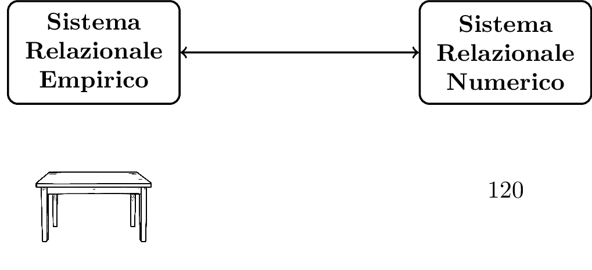
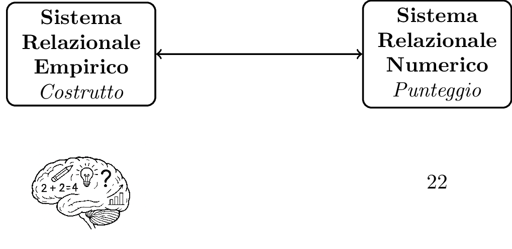

# Psicometria per la neuropsicologia clinica {#psicometria-per-la-neuropsicologia-clinica}

## Perché è importante misurare?
Un intero capitolo dedicato alla misurazione non può che iniziare da una possibile definizione di cosa si intende appunto per misurazione:

_La misurazione è l'utilizzo di numeri per descrivere delle entità di interesse_. 

Come vedremo nel [prossimo paragrafo](#misurazione_e_neuropsicologia_clinica), esistono svariate possibili definizioni di misurazione, con implicazioni non banali, ma accontentiamoci per il momento di questa sopra per fare alcune prime considerazioni.
Innanzitutto, misurare quasi sempre è associato all'ottenimento di _numeri_, cioè punteggi, che ci aiutano nella descrizione di qualcosa. Queste _entità di interesse_ in neuropsicologia sono di diverso tipo, ma il più delle volte sono funzioni cognitive, come attenzione o memoria.

Per misurare utilizziamo i **test** cioè specifici strumenti  sviluppati appositamente in ambito psicologico e neuropsicologico. Anche i test saranno oggetto di un [paragrafo dedicato](#i-test)

`\pagebreak`{=latex}

Prima di cominciare ad entrare in tutti i dettagli è importante soffermarsi su una domanda fondamentale: 

:::{.domanda}
_Perché è importante misurare?_ 
:::

Non possiamo dare per scontato che sia una cosa necessaria o indispensabile e anzi, è utile riflettere sull'utilità di utilizzare numeri per descrivere qualcosa.

La misurazione è innanzitutto considerata una delle basi del metodo scientifico e un approccio scientifico e basato sull'evidenza, non può che passare dalla misurazione. Un celebre aforisma (probabilmente apocrifo) di Galileo Galilei, uno dei padri del metodo scientifico è: _misura ciò che puoi misurare, rendi misurabile ciò che non lo è_ .  Anche ogni libro che parli di epistemologia, cioè la filosofia della scienza, tende ad avere un capitolo o una sezione dedicata alla misurazione, a sostegno di quanto sia fondamentale per il processo scientifico `(\cite{boniolo1999filosofia})`{=latex}`(Boniolo & Vidali, 1999)`{=html}. In breve quindi:

_misurare in neuropsicologia clinica ci permette di adottare un approccio scientifico e andare oltre la semplice osservazione clinica qualitativa_

Fermiamoci adesso un attimo a riflettere su quale è lo scopo di una valutazione neuropsicologica. Lo scopo potrebbe essere l'accertamento sul sospetto di una patologia in corso (es. un sospetto di demenza, sospetto di ADHD), o la caratterizzazione di un disturbo cognitivo in una condizione accertata (es. capire se un trauma cranico ha avuto delle conseguenze). Le informazioni possono avere fini diagnostici, prognostici, o di monitoraggio longitudinale. Nel caso di monitoraggio longitudinale questo in genere è effettuato per investigare il decorso di una patologia nel tempo o per valutare l'effetto di un trattamento riabilitativo.
La misurazione è utile perché ci permette dunque di avere più informazioni rilevanti per la valutazione neuropsicologica e di risultati più _oggettivi_[^ogg].

[^ogg]: per _oggettivo_ indichiamo un risultato che non è dipendente da chi sta effettuando l'esame.

Ma effettuare delle misurazioni ci è utile anche per altro: utilizzare dei punteggi ci permette di creare una sorta di _linguaggio comune_ per la discussione di un caso clinico. Oltre ad alcune etichette cliniche diffuse in certi ambiti, come _decadimento cognitivo lieve_, _decadimento cognitivo moderato_, i punteggi ai test rappresentano infatti un'opportunità per comunicare rapidamente lo stato di un individuo. Per esempio per chi lavora in ambito di disturbi cognitivi nell'ambito delle demenza, dire che un paziente ha un MMSE (MiniMental State Examination; `(\cite{folstein1975mini})`{=latex}`(Folstein et al., 1975)`{=html}) pari a 12, denota senza bisogno di ulteriori dettagli uno stato di decadimento cognitivo piuttosto grave. Questo aspetto è approfondito nel paragrafo _"Focus: utilizzare i punteggi per comunicare"_. <!-- NOTA GIORGIO: mettere qui anche dei link a paragrafi specifici-->

È inoltre importante notare che in alcune branche della psicologia clinica l'utilizzo di punteggi e la misurazione non sono considerati necessari o fondamentali. Si pensi ad esempio ad approcci come la psicoanalisi, o alcuni approcci costruttivisti alla psicoterapia. Entrambi non fanno quasi uso di strumenti di misurazione e i test hanno spesso un ruolo nullo o marginale.
Quando si parla però di neuropsicologia clinica o di valutazione neuropsicologica, la prima cosa che viene in mente è invece una persona che sta effettuando una serie di test per riuscire a comprendere lo stato cognitivo di un individuo e una serie di punteggi ottenuti da questi test: la misurazione sembra un aspetto imprescindibile. Provando a chiedere a ChatGPT4.0 la seguente cosa _Crea un disegno in bianco e nero di una neuropsicologa che sta effettuando una valutazione neuropsicologica_ il risultato che ho ottenuto (14/09/2025) è la figura qui di seguito: una persona che sta somministrando un test, verosimilmente per misurare qualche aspetto del funzionamento cognitivo della persona esaminata.

{#fig-chatgpt-valutazione fig-align="center" width=60%}

In altre parole, la neuropsicologia clinica come disciplina _presuppone_ che la misurazione degli oggetti di interesse (funzionamento cognitivo, rischio di sviluppare una malattia, ecc.) consenta di raggiungere conclusioni diagnostiche migliori, di fare scelte terapeutiche più efficaci e, in generale, di svolgere una migliore attività clinica (si veda il paragrafo *"Epistemologia della neuropsicologia clinica"* per ulteriori dettagli). 
La misurazione, cioè l'utilizzo di punteggi, ci aiuta a quantificare delle proprietà di interesse e poter fare delle scelte cliniche più precise rispetto al solo utilizzo della osservazione clinica qualitativa e basate su evidenze scientifiche. Il più delle volte questo implica che i punteggi sono confrontati con delle soglie e se i valori sono al di là di queste soglie, viene concluso che il risultato ha rilevanza clinica (useremo più avanti termini più tecnici e definizioni più precise). La persona con il punteggio al di là della soglia potrebbe avere un deficit cognitivo, o forse un rischio di avere una patologia neurodegenerativa o un disturbo del neurosviluppo. 

Va da sé, che se questo è uno dei presupposti della neuropsicologia clinica come disciplina, effettuare correttamente le misurazioni è un primo aspetto fondamentale che determinerà la qualità della nostra attività clinica.

## Misurazione e neuropsicologia clinica{#misurazione_e_neuropsicologia_clinica}

La disciplina che si occupa della misurazione in psicologia (e in neuropsicologia) è la **psicometria**, una delle discipline che, insieme alla statistica, rappresentano le fondamenta di questo libro. La psicometria si occupa proprio delle questioni della misurazione in psicologia, una tipologia di misurazione molto particolare perché non tratta di proprietà di oggetti fisici ma di **costrutti**, cioè concetti psicologici non osservabili.

::: {.callout-note}
## Definizione
**Costrutto**:
Un concetto psicologico non direttamente osservabile (es. memoria, attenzione, intelligenza). Per renderlo misurabile, è associato ad uno o più _indicatori_ (o _proxy_ in inglese).
\vspace{1em}

**Indicatore**
Un comportamento osservabile che, da solo o insieme ad altri, si assume sia manifestazione di un costrutto a cui è associato. In neuropsicologia clinica, sono tipici indicatori le risposte ad un test. 
:::

Il fatto che i costrutti siano proprietà non osservabili non è di per sé un problema insormontabile ed è comune in vari ambiti diversi da quello psicologico. Per esempio, si pensi, al campo magnetico prodotto da un oggetto, o alla sua temperatura, entrambe proprietà non direttamente osservabili ma misurabili attraverso indicatori fisici.

Consideriamo il classico termometro con colonnina di galinstan (un tempo a mercurio). La _temperatura_ del nostro corpo non è direttamente osservabile ma possiamo misurarla grazie a un indicatore fisico osservabile: l'espansione di una colonna di un metallo liquido (galinstan o mercurio) all'interno del termometro. Quando la temperatura aumenta, il liquido si espande e la sua variazione in lunghezza viene trasformata in un numero che rappresenta la proprietà fisica che ci interessa, cioè la temperatura. Nessuno mette in dubbio la bontà di questa misurazione perché diamo per scontata con precisione la relazione fisica tra la temperatura e l'espansione del metallo.

La misurazione psicologica funziona in modo analogo, con indicatori osservabili (es. le risposte a un test), associati a costrutti non osservabili che intendiamo misurare. La psicometria, come disciplina, si occupa proprio di come rendere questa relazione il più precisa e giustificata possibile (questo esempio è ripreso e approfondito anche nel paragrafo [_"i test"_](#i-test)).

Una caratteristica peculiare della misurazione psicologica è infatti che la relazione tra ciò che è l'esito della misura (cioè il punteggio) e ciò che si vuole misurare, cioè il costrutto, è molto indiretto. <!--(Nota Giorgio: qui si parlava  di numeri e poi la citazione di lezak è su comportamento-->  Nel suo manuale "Neuropsychological Assessment", Muriel Lezak, una delle persone più influenti nella neuropsicologia clinica riporta questo passaggio (di Sivan & Benton, 1999) molto esplicito a riguardo.

_“Le abilità cognitive (e le disabilità) sono proprietà funzionali dell’individuo che non vengono osservate direttamente, ma piuttosto inferite dal comportamento. Ogni comportamento (compresa la performance nei test neuropsicologici) è determinato da molteplici fattori: l’insuccesso di un paziente in una prova di ragionamento astratto può non dipendere da un deficit specifico nel pensiero concettuale, ma da un disturbo dell’attenzione, da una difficoltà verbale o dall’incapacità di discriminare gli stimoli della prova.”_ `(\cite{sivan1999cognitive})`{=latex}`(Sivan & Benton, 1999)`{=html}

In breve: 

_Non esiste una corrispondenza univoca tra un comportamento e uno specifico aspetto del funzionamento cognitivo (normale o deficitario). Quasi per definizione ogni comportamento è riconducibile a più funzioni cognitive_. <!--(Nota Giorgio: aggiungere? altre citazioni qui?) -->

È importante sottolineare che in neuropsicologia clinica non si effettuano solo misurazioni di costrutti. In numerosi casi infatti i punteggi hanno un diverso scopo, come stimare la probabilità di sviluppare una patologia neurologica, la probabilità di sviluppare sintomi comportamentali, o semplicemente predire quale potrebbe essere il punteggio di un test particolarmente lungo a partire da un test più breve. Distinguere tra questi casi è rilevante perché alcuni metodi psicometrici e alcune considerazioni statistiche valgono solo per i test che misurano costrutti oppure solo per i test che _non_ misurano costrutti. Tutti questi aspetti saranno approfonditi nei paragrafi e capitoli successivi <!-- NOTA GIORGIO: Aggiungere hyperlink corretti qui -->


### La definizione di misurazione di S.S. Stevens (1946) e le scale di misura

La più famosa definizione di misurazione è certamente quella di S.S. Stevens, che in un articolo del 1946 ha fornito una definizione che ha influenzato (nel bene e nel male) la storia della psicologia:

::: {.callout-note}
## Definizione
**Misurazione secondo Stevens**

_"...possiamo dire che la misurazione, nel senso più ampio, è definita come l’assegnazione di numeri a oggetti o eventi secondo determinate regole.”_  `(\cite{stevens1946measurement})`{=latex}
`(Stevens, 1946)`{=html} - p. 667 

:::

La proposta di Stevens va contestualizzata al clima del momento. Alla fine degli anni quaranta si stava discutendo in ambito scientifico se gli oggetti di interesse della psicologia potessero essere misurati e se, quindi, la psicologia potesse essere considerata una scienza. L'iniziale conclusione di una commissione internazionale di fisici e psicologi che si era riunita per dare una risposta a questa domanda era arrivata alla conclusione che, secondo una definizione rigorosa di misurazione, la risposta era _no_. 
Secondo Stevens però, il problema era proprio nei presupposti della commissione e, più in particolare, nella definizione troppo restrittiva di misurazione. Propose dunque la definizione riportata sopra, e sottolineò che anche se ogni regola porta a misurazione, un aspetto importante (ma separabile) è l'utilizzo che si può fare dei numeri o classificazioni e questo dipende dalla **Scala di misura**. A seconda delle proprietà misurate potrebbe quindi essere diverso l'utilizzo che possiamo fare dei numeri. La proposta di Stevens salvava la psicologia come scienza e anzi aiutava a chiarire l'utilizzo dei numeri per la misurazione in diverse circostanze.


Esistono quattro scale di misura: _categoriale, ordinale, a intervalli, a rapporti_. Queste scale possono essere organizzate gerarchicamente (categoriale al livello più basso, a rapporti al livello più alto), e le operazioni possibili ad un livello più basso sono possibili a tutti i livelli superiori. Per esempio calcolare la mediana è possibile a livello di scala ordinale, ma anche nella scala ad intervalli e a rapporti in quanto più alte nella gerarchia. Da notare che anche il solo rilevare se una persona è femmina o maschio è, secondo la definizione di Stevens, un caso di misurazione, utilizzando una _scala categoriale_. In questo caso non hanno senso operazioni tipo addizione o sottrazione o moltiplicazione (non ha senso dire che una femmina è due volte un maschio o viceversa) e una delle poche operazioni possibili è contare quanti casi abbiamo per ogni categoria (es. confrontare il numero di femmine con il numero di maschi). Un riassunto delle scale e delle operazioni possibili è riportato nella tabella 1.2.


```{=latex}
\begingroup
{\scriptsize
```

| Scala        | Descrizione                                                                 | Esempio                         | Operazioni possibili                                   |
|--------------|------------------------------------------------------------------------------|---------------------------------|--------------------------------------------------------|
| **Nominale** | Classificazione in categorie senza ordine implicito                         | Sesso (M/F), Colori, Nazionalità | Conteggio, moda, verifica uguaglianza/differenza      |
| **Ordinale** | Classificazione con ordine, ma le distanze tra categorie non hanno significato   | Posizione in una classifica, Titolo di studio | Ordinamento, mediane, percentili                     |
| **Intervallo** | Misura con ordine e intervalli uguali, ma senza zero assoluto significativo | Temperatura in °C, IQ           | Addizione, Sottrazione,Media, Deviazione standard, z-score                |
| **Rapporto** | Misura con ordine, intervalli uguali e lo zero ha un significato          |  Età, Scolarità in anni, tempi di reazione | Tutte le operazioni aritmetiche (×, ÷, +, −), z-score, rapporti|
:Tabella 1.2: Le quattro tipologie di scale di misura secondo S.S. Stevens.

**Legenda**  
- *Scala*: tipo di misura secondo la classificazione di Stevens.  
- *Descrizione*: caratteristiche principali della scala.  
- *Esempio*: variabili reali che rientrano in quella scala.  
- *Operazioni possibili*: trasformazioni matematiche e statistiche consentite dai dati.

```{=latex}
}
\endgroup
```

L'idea di avere una definizione di misurazione molto generica, accompagnata ad una distinzione di scale di misura è molto potente e tuttora è molto influente nella misurazione in psicologia. Come anticipato, però, ci sono anche altre definizioni. Nel prossimo paragrafo sarà approfondita una di queste, che entrava in contrasto con la proposta di Stevens. <!-- forse aggiungere che questa definizione non è prima di problemi). -->

### Definizione di Misurazione secondo Suppes e Zinnes (1963)

Un'altra possibile definizione di misurazione, molto celebre in psicometria è quella di Suppes e Zinnes `(\cite{suppes1963basic})`{=latex} `(\cite{suppes1963basic})`{=html}. A differenza di quella di Stevens è più rigorosa e formale, ma anche più complessa e meno intuitiva e per essere capita necessita alcune definizioni preliminari.

Definiamo  _Sistema Relazionale Empirico_, come l'insieme di entità del mondo empirico che hanno una determinata proprietà che vogliamo misurare (es. oggetti di diversa lunghezza) e il _Sistema Relazionale Numerico_ un insieme di numeri (es. i numeri Reali) con i quali vogliamo descrivere il sistema Relazionale Empirico. 

{#fig-measurement-fisico fig-align="center" width=70%}

::: {.callout-note}
## Definizione
**Misurazione secondo Suppes e Zinnes (1963)**

La misurazione consiste in un **omomorfismo** tra un _Sistema Relazionale Numerico_ e un _Sistema Relazionale Empirico_.

:::

Con _omomorfismo_ si intende una corrispondenza tra i due sistemi che preserva le relazioni tra gli elementi. Ad esempio, se nel Sistema Relazionale Empirico abbiamo una relazione di ordine (ad esempio, l'oggetto A è più lungo dell'oggetto B), allora questa relazione deve essere preservata nel Sistema Relazionale Numerico (il numero associato all'oggetto A deve essere maggiore del numero associato all'oggetto B).

Nell'esempio della @fig-measurement-fisico, un tavolo ha un lato lungo 120 cm. Possiamo usare questo numero (120) per numerosi utilizzi. Supponiamo ad esempio di avere due tavoli quadrati, uno con il lato di 120 cm e uno con il lato di 60 cm. Tramite questa misurazione del loro lato, sappiamo che il tavolo con lato 120 cm è più lungo di quello con lato 60 cm. Sappiamo che il tavolo con lato 120 cm ha il lato di 60 cm più lungo di quello con lato 60 cm. Infine sappiamo che il tavolo con lato 120 cm è lungo il doppio del tavolo con lato 60 cm (nello stesso spazio del tavolo lungo 120 cm, possiamo mettere due tavoli da 60 cm). Questi numeri ci permettono dunque di una serie di operazioni utili per comprendere le proprietà dei tavoli, in questo caso la loro lunghezza, e interagire con loro[^scale]. La stessa cosa accade quando vogliamo fare una misurazione psicologica o neuropsicologica: lo scopo è ottenere un numero che vogliamo utilizzare per alcuni scopi (si veda @fig-measurement-psicologico).

[^scale]:Tornando per un attimo alla Definizione di misurazione di Stevens  e alla Tabella 1.2, La lunghezza di un tavolo sarebbe misurata su una _scala a rapporti_ e sapere questo ci permette di sapere quali operazioni possiamo fare con i numeri associati alla misura. 


{#fig-measurement-psicologico fig-align="center" width=70%}

In questo caso possiamo dire che il nostro Sistema Relazionale Empirico[^sis] è dato dall'insieme di tutti i possibili livelli di memoria e il Sistema Relazionale Numerico come l'insieme di numeri che utilizziamo per descrivere questi livelli memoria. 
Alcune operazioni con questi numeri sono intuitivamente sensate, ad esempio possiamo dire che alcune persone hanno più memoria di altre (possiamo quindi ordinare), ma nel momento in cui cerchiamo di capire l'applicabilità di altre operazioni diventa più difficile rispondere. Ad esempio, tramite un test possiamo arrivare a dire che una persona ha il doppio di memoria di un altra? Oppure che ha +20 unità di memoria più di un'altra? (qualsiasi sia questa unità). La risposta non è ovvia, e non possiamo darla per scontata solo perché abbiamo dei numeri. Suppes e Zinnes sostengono che non si possa assumere automaticamente che determinate operazioni sui numeri abbiano un senso. Occorre invece verificare che il sistema numerico rappresenti adeguatamente la struttura delle relazioni empiriche osservate; solo in questo caso le operazioni effettuate sui numeri possono essere interpretate come operazioni dotate di senso sul costrutto misurato[^supp].

<!-- Per sezione "Approfondimenti tecnici"
Rispetto alla definizione di Suppes e Zinnes questo potrebbe essere possibile o no ed è una dei possibili esiti  ed è attraverso la verifica empirica della tenuta degli _assiomi sulla struttura relazionale empirica_[^supp], e quale tipo di, omomorfismo sia giustificato. Secondo Suppes e Zinnes, è questo processo di verifica assiomatica a determinare quali operazioni numeriche siano legittime sul costrutto misurato. ed è attraverso la verifica empirica della tenuta degli assiomi sulla struttura relazionale empirica che si può stabilire se, e quale tipo di, omomorfismo sia giustificato. Secondo Suppes e Zinnes, è questo processo di verifica assiomatica a determinare quali operazioni numeriche siano legittime sul costrutto misurato.
Ad esempio, supponiamo di avere un test di memoria e di voler giustificare una scala ordinale. È necessario verificare empiricamente che la relazione "ha più memoria di" tra soggetti sia transitiva (se A ricorda più items di B, e B più di C, allora A ne ricorda più di C) e connessa (per ogni coppia di soggetti, uno dei due ricorda più dell'altro o sono equivalenti). Se la transitività fallisce sistematicamente nei dati, cosa empiricamente possibile, la scala ordinale non è giustificata, indipendentemente da come è costruito il test. Voler affermare che una persona ha +20 unità di memoria più di un'altra richiederebbe assiomi aggiuntivi, più forti, sull'equivalenza delle differenze tra punteggi, assiomi che nella pratica psicometrica raramente vengono verificati esplicitamente.
-->


[^supp]: questo aspetto è affrontato più in dettaglio nella sezione _Approfondimenti tecnici_


[^sis]:è importante notare che non tutti sarebbero d'accordo nel dire che l'insieme di costrutti psicologici (cioè concetti non osservabili) sono parte di un sistema relazionale empirico. La domanda è però proprio al confine dell'epistemologia: un concetto psicologico non osservabile è parte del mondo empirico (così come lo sono altri entità non osservabili) oppure no? Per i nostri scopi la diversa collocazione dei concetti psicologici (come entità del mondo empirico o no), è irrilevante. Qui assumo che i concetti psicologici siano di fatti parte dei sistemi relazionali empirici in un certo senso aggirando il problema, e utilizzando la definizione di sistema relazionale empirico come ogni sistema relazionale _non_ numerico.

<!-- NOTA: forse aggiungere definizione breve di Rasch come ponte per IRT_ -->

## Quale definizione di misurazione adottano i test neuropsicologici?
Visto che esistono diversi modelli di misurazione, viene spontaneo chiedersi quale di essi adottino i test neuropsicologici (specie quelli disponibili in Italia) e quali conseguenze pratiche ne derivino.

La risposta non è semplice: per la maggior parte dei test, il modello di misurazione sottostante non viene mai dichiarato esplicitamente. Tuttavia, se facciamo un ragionamento al contrario e cerchiamo di desumerlo a partire dall'utilizzo che si fanno dei punteggi, possiamo dire che implicitamente si assuma la definizione di Stevens e che la misura sia su scala ad intervalli. 


::: {.callout-important}

Nella maggior parte dei test neuropsicologici _si assume_ implicitamente che la misura sia su scala a intervalli.

:::

 Ricordiamo che assumere una scala ad intervalli significa che le differenze tra punteggi hanno un significato costante lungo tutta la scala. Un esempio classico è la temperatura in gradi Celsius: un aumento di 2°C ha lo stesso significato indipendentemente dal valore di partenza (che si passi da 36° a 38° o da 38° a 40°, in entrambi i casi la variazione è identica).

Proviamo però ad applicare lo stesso ragionamento a qualche test neuropsicologico, in maniera intuitiva. Prendiamo ad esempio il MoCA `(\cite{nasreddine2005montreal})`{=latex}`(Nasreddine et al., 2005)`{=html}, uno strumento di screening cognitivo con punteggio da 0 a 30. Se fosse davvero misurato su una scala a intervalli, un aumento di 2 punti dovrebbe avere lo stesso significato sia partendo da 24 sia partendo da 28. Eppure un aumento da 28 a 30 porta a un punteggio perfetto, mentre uno da 24 a 26 indica due diversi livelli di prestazione media/medio-alta[^mis3]. Per chi conosce il test è quantomeno discutibile sostenere che le due variazioni abbiano lo stesso significato.

Lo stesso vale per il Digit Span, test in cui si chiede di ricordare sequenze di numeri di lunghezza crescente e il punteggio corrisponde alla sequenza più lunga correttamente richiamata. Un aumento di 2 punti da 3 a 5 segna il passaggio da una prestazione molto bassa a una intermedia; un aumento da 8 a 10 porta invece da una prestazione già eccellente a una quasi irraggiungibile (provate a ricordare una sequenza di 10 cifre per capire). Anche qui le due variazioni potrebbero non sembrare equivalenti.

Questi esempi, per quanto informali, mostrano come interpretare i punteggi grezzi di un test come se fossero su scala a intervalli non si possa dare per scontato. Eppure, la maggior parte dei test neuropsicologici non riporta evidenze o non effettua verifiche che mostrino l'effettiva adeguatezza dell'utilizzo di una scala ad intervalli.

[^mis3]: per complicare ulteriormente il quadro qualcuno che conosce il MoCA potrebbe anche dire che il significato di questi $+2$, dipende molto da quale è l'item (o gli item) a cui è legato questo punteggio, questo esempio è trattato in un [Approfondimento](#Approfondimento-item-arbitrari)).

<!-- aggiungere qui forse esempio con scale di misura dell'indicatore e scala di misura del cosrutto?-->

Chi ha già utilizzato test neuropsicologici in ambito clinico potrebbe obiettare che il problema è di scarsa rilevanza pratica, almeno quando i test vengono usati semplicemente per stabilire se un punteggio è al di sopra o al di sotto di una soglia di deficit: in quel caso non si effettuano addizioni o sottrazioni, ma ci si limita a confrontare il punteggio con un valore di riferimento (questo argomento sarà trattato in dettaglio nel [Capitolo 2](#Capitolo2)). Tuttavia, vi sono situazioni in cui operazioni che implicano una scala ad intervalli entrano in gioco anche nella pratica quotidiana. Un esempio tipico sono le *correzioni* per età e scolarità, trattate nel capitolo 2 e nell'approfondimento sulle regressioni: queste correzioni consistono nell'aggiungere o sottrarre un valore al punteggio grezzo, operazioni che hanno senso solo su una scala ad intervalli. Anche molti dei metodi utilizzati per misurare cambiamenti nel tempo (vedi paragrafo  <!-- NOTA GIORGIO aggiungere qui paragrafo --> ), spesso assumono una scala ad intervalli, con implicazioni non banali sull'interpretazione dei risultati. L'aspetto più delicato di questa discussione è che il trattare i punteggi come se fossero su una scala ad intervalli è una sorta di punto di partenza e un'assunzione implicita non dimostrata, piuttosto che qualcosa verificata empiricamente (come Suppes e Zinnes suggeriscono nel loro modello di misurazione). 
Anche se quanto appena detto potrebbe sembrare una speculazione da psicometristi, con poco impatto pratico, nel corso di questo libro cercherò di dimostrare che non lo è, e che anzi, in certi casi è una semplificazione che non possiamo dare per scontata. 


<!--
Tutte queste considerazioni sono sensate e condivisibili, ma, dal punto di vista della teoria della misurazione, si tratta di ragionamenti fondati sul buon senso clinico, non su un modello formale. Conoscere queste basi teoriche permette al neuropsicologo di comprendere meglio le implicazioni delle proprie scelte e di orientarsi in modo più consapevole tra gli strumenti disponibili.
-->


È doveroso anticipare già adesso che non sempre i test psicologici soffrono di queste problematiche. Alcuni infatti sono costruiti in modo tale che il significato delle variazioni di punteggio sia formalmente definito e preciso, grazie all'impiego di modelli alternativi di misurazione, ad esempio quelli appartenenti all' **Item Response Theory**. Purtroppo, per ragioni pratiche e storiche, strumenti con tali caratteristiche sono ancora poco diffusi nella pratica neuropsicologica italiana, e dobbiamo quindi accontentarci di test che assumono una scala ad intervalli, con tutte le problematicità evidenziate (si veda il paragrafo Introduzione all'Item Response Theory per un approfondimento).

Devo però anche anticipare che adotterò una posizione molto pragmatica su questo aspetto. Anche quando alcune assunzioni di un test risultano discutibili, ciò non significa che il test vada scartato: uno strumento con limitazioni può essere comunque più utile di una valutazione clinica puramente qualitativa.

Ricapitolando: la maggior parte dei test neuropsicologici adotta implicitamente la concezione della misurazione proposta da Stevens e tratta i punteggi come misure su scala a intervalli, senza però esplicitare o verificare l'adeguatezza di tale assunzione. 
Gli esempi forniti sul MoCA e del Digit Span mostrano come questa assunzione non si possa però dare per scontata con leggerezza. Va tuttavia chiarito che il neuropsicologo non deve porsi quotidianamente il problema della scala di misurazione, a meno che non decida di effettuare operazioni sui punteggi al di là di quelle previste dalla pratica clinica standard. 
Il messaggio centrale è: _ottenere dei numeri non ci autorizza a fare di essi ciò che vogliamo_. Alcune operazioni, pur tecnicamente possibili, possono essere delicate o problematiche, e sapere che derivano da un'assunzione discutibile è fondamentale per un'interpretazione consapevole dei punteggi.

Abbiamo parlato a lungo di misurazione, ma lasciamo adesso spazio a quelli che sono gli strumenti di misurazione in neuropsicologia: i test.

## I test {#i-test}
Già dall'introduzione è stato detto che il protagonista assoluto del libro è il test neuropsicologico. Ma cos'è un test? Come sempre, non possiamo non procedere senza fornire una definizione precisa che ci aiuti a definire cosa è un test (e cosa non lo è) e quali sono le caratteristiche che lo contraddistinguono.

Esistono in letteratura numerose definizioni di test e, come spesso accade in psicometria, non esiste un consenso unanime su quale sia la più adeguata. Una delle più influenti in ambito psicologico è quella proposta da Lee Cronbach nel suo manuale sul testing psicologico:

::: {.callout-note}
## Definizione
**Test secondo Cronbach (1990)**

_"Un test è una procedura sistematica per l'osservazione del comportamento di una persona e per la sua descrizione con l'aiuto di una scala numerica o tramite categorie prefissate."_ `(\cite{cronbach1990essentials})`{=latex}`(Cronbach, 1990)`{=html} (p. 32)
:::

Fermiamoci a riflettere un attimo sui vari aspetti catturati da questa definizione:

_"Un test è una procedura sistematica ..."_

Questa parte della definizione sottolinea che un test non è semplicemente un insieme di materiali, ma è un processo ben definito e una "procedura", cioè una sequenza di passaggi che devono essere seguiti affinché si possa dire che è stato somministrato esattamente quel test. 

_"... per l'osservazione del comportamento ..."_

In questa seconda parte della definizione, viene sottolineato quanto già detto riguardo la misurazione psicologica: i test psicologici si basano sull'osservazione di comportamenti.

_"... e per la sua descrizione con l'aiuto di una scala numerica o tramite categorie prefissate."_

In quest'ultima parte della definizione, è catturata l'essenza dell'esito di una misurazione: un punteggio o l'appartenenza ad una categoria (es. "sano", "Mild Cognitive Impairment").


:::{.callout-important}
## Nota
Il fatto che un test sia una **procedura sistematica** implica che, per somministrarlo correttamente, occorre attenersi scrupolosamente alla procedura originale: quella indicata dagli autori, nel manuale del test o nella pubblicazione scientifica di riferimento. Anche una deviazione apparentemente piccola può avere un impatto rilevante sui risultati e sulla loro interpretazione, producendo effetti a cascata difficili da prevedere. Per esempio, modificare leggermente le istruzioni, anche con il nobile intento di essere più chiari, può rendere il test più facile e alterare il significato del confronto con i dati normativi (si veda il paragrafo sui dati normativi). <!-- aggiungi qui hyperlink al paragrafo sui dati normativi -->
:::

Questa definizione ha il vantaggio di essere ampia e inclusiva: si applica tanto ai test cognitivi quanto ai questionari di personalità, alle scale di autovalutazione e a molti altri strumenti di misura in ambito psicologico. Tuttavia, presenta un limite importante per i nostri scopi, che è facile identificare con un esempio.
 Provate a immaginare uno strumento che valuti l'equilibrio di una persona durante il cammino tramite una serie di prove fisiche. Per ogni prova superata si dà un punteggio di 1, e il punteggio globale è dato dalla somma dei punteggi delle varie prove. Questo strumento soddisferebbe formalmente la definizione di Cronbach: è una procedura sistematica, per osservare il comportamento e lo descriverebbe con una scala numerica (il punteggio totale). Tuttavia, questo strumento non sarebbe un test "psicologico". 

La definizione di Cronbach è utile quindi perché permette di sottolineare, tramite una mancanza, un punto fondamentale che contraddistingue i test psicologici: a differenza di altri tipi di test, i test psicologici non hanno quasi mai interesse solo nel comportamento osservato (le risposte del paziente agli item del test) ma nel **costrutto** psicologico che si vuole misurare (vedi [paragrafo precedente](#cosa-misuriamo-in-neuropsicologia-clinica)). Il punteggio è dunque una rappresentazione _indiretta_ di qualcosa di non direttamente osservabile (memoria, attenzione, funzioni esecutive, ecc.), tramite un comportamento osservabile. Questa relazione è rappresentata nella @fig-costrutto-punteggio.

{#fig-costrutto-punteggio fig-align="center" width=80%}

Da notare che quanto appena detto è, in sostanza, quello che abbiamo già trattato nel paragrafo [_"misurazione e neuropsicologia clinica"_](#misurazione_e_neuropsicologia_clinica).
Riprendiamo l'esempio della misurazione con un termometro e approfondiamolo. La situazione di una misurazione indiretta in psicologia potrebbe sembrare non troppo diversa da quella dell'esempio del termometro: del resto anche la temperatura non è direttamente osservabile, ma è legata a un indicatore osservabile (l'espansione del galinstan o mercurio) che ci permettono di ottenere un numero (i gradi) che rappresenta indirettamente ciò che vogliamo misurare. 
Nonostante questa apparente somiglianza, la misurazione in neuropsicologia, e in psicologia in generale, è molto più complessa. Senza scendere troppo nei dettagli la ragione è che la relazione tra costrutto psicologico e indicatore è molto più complessa di quello che accade con gli indicatori osservabili di misurazioni fisiche. Più nello specifico non esiste una relazione _causale_ univoca tra proprietà non osservabile e comportamento osservabile: avere una certa memoria non determina in maniera causale che si ottenga un certo comportamento (piuttosto probabilistica, vedi paragrafo "Altri modelli di misurazione"). A complicare le cose, molte variabili non direttamente di interesse possono alterare in maniera importante la relazione tra costrutto e comportamento osservabile (cioè l'indicatore). Sempre in relazione al punteggio al test di memoria si consideri per esempio la motivazione, l'umore, la fatica, la stanchezza, l'ansia, la confusione, la distrazione, la presenza di dolore o di sintomi fisici, e così via. Tutte queste variabili possono influenzare il comportamento osservato (le risposte al test) e di conseguenza il punteggio ottenuto, indipendentemente dal costrutto di interesse (la memoria).

{#fig-altre-variabili fig-align="center" width=80%}

<!-- RIPETIZIONE, DA TOGLIERE?
Questo è in linea con le parole di Sivan & Benton (1999) citate da Lezak nel [paragrafo sulla misurazione](#misurazione_e_neuropsicologia_clinica), le abilità cognitive "non vengono osservate direttamente, ma piuttosto inferite dal comportamento". Questa considerazione, che può sembrare ovvia, merita di essere ripetuta perché ha conseguenze rilevanti per l'interpretazione dei punteggi: lo stesso risultato potrebbe riflettere abilità cognitive diverse a seconda del paziente e del contesto clinico, e come tratteremo nel corso dei capitoli di questo libro, richiede un'interpretazione critica dei risultati.
-->

`\pagebreak`{=latex}


### Tipologie di test
Esistono diverse tipologie di test così come diversi modi di poterli classificare. Di seguito vengono descritti i principali tipi di test utilizzati in neuropsicologia clinica. Fornire una classificazione è utile perché diversi tipi di test hanno diverse peculiarità di tipo psicometrico. Nel corso del libro specificheremo quando alcune considerazioni si applicano solo, o prevalentemente, ad un tipo di test.

#### Test di prestazione massima

I **test di prestazione massima** (_maximal performance tests_) sono strumenti in cui si chiede al paziente di impegnarsi al massimo delle proprie capacità per ottenere il miglior risultato possibile. L'obiettivo è valutare _cosa una persona è in grado di fare_ quando le condizioni sono ottimali e lo sforzo è massimo. La maggior parte dei test neuropsicologici per la valutazione delle funzioni cognitive (test di memoria, attenzione, funzioni esecutive, linguaggio, abilità visuospaziali) rientra in questa categoria. Il punteggio ottenuto è interpretato come una stima della capacità massima del paziente in quel dominio cognitivo.

#### Test di comportamento tipico{#test-di-comportamento-tipico}

I **test di comportamento tipico** (_typical behaviour tests_) sono invece strumenti progettati per valutare come una persona si comporta o risponde _tipicamente_, ovvero nel suo quotidiano, non necessariamente con un sforzo massimo. In questi strumenti non esiste una risposta "giusta" da dare. Rientrano in questa categoria due grandi famiglie di strumenti:

- **Autosomministrati** (compilati dal paziente stesso): questionari di personalità, scale di autovalutazione per sintomi psicologici come ansia e depressione (es. Beck Depression Inventory `(\cite{beck1961inventory}`{=latex}`(Beck et al., 1961)`{=html}, Hamilton Anxiety Scale `\cite{hamilton1959assessment})`{=latex}`(Hamilton, 1959)`{=html}), scale per la qualità della vita. Il paziente descrive come si sente o come si comporta generalmente.
- **Eterosomministrati** (compilati dal clinico o da un caregiver): scale per la valutazione del funzionamento nelle attività quotidiane, come le ADL, _Activities of Daily Living_; `(\cite{katz1963studies})`{=latex}`(Katz et al., 1963)`{=html} e le IADL, _Instrumental Activities of Daily Living_ `(\cite{lawton1969assessment})`{=latex}`(Lawton & Brody, 1969)`{=html}. In questo caso è il clinico o un familiare a rispondere sulla base dell'osservazione diretta del paziente, non il paziente stesso.

La distinzione tra questi due tipi di test è rilevante per la somministrazione, per l'interpretazione dei punteggi e per il tipo di costrutto che si intende misurare.


#### Altri strumenti utili per la valutazione neuropsicologica

Nella pratica clinica, accanto ai test di prestazione massima e ai questionari di comportamento tipico, esiste una terza categoria di strumenti che fanno parte della valutazione neuropsicologica standard pur non rientrando in senso stretto nella classificazione fin qui descritta: si tratta di **questionari e scale somministrate come parte integrante della valutazione clinica**, non per misurare una funzione cognitiva o altri costrutti psicologici legati a comportamenti abituali, ma per raccogliere informazioni contestuali utili per l'interpretazione dei risultati.

L'esempio più rilevante in ambito neuropsicologico e che negli ultimi anni ha avuto sempre più utilizzo è la stima della **riserva cognitiva**. La riserva cognitiva, cioè la capacità del cervello di compensare per i danni di una la patologia degenerativa o acuta senza manifestare sintomi espliciti, è considerata una variabile moderatrice importante nell'interpretazione delle prestazioni cognitive, soprattutto nelle valutazioni legate a patologie neurodegenerative. Per stimarla si utilizzano strumenti come il **CRIq** (_Cognitive Reserve Index questionnaire_; `(\cite{nucci2012cognitive})`{=latex}`Nucci et al., 2012`{=html}), un questionario in cui si raccolgono informazioni su anni di istruzione, attività lavorativa e attività del tempo libero nel corso della vita. Il CRIq non è un test di prestazione massima: non si chiede al paziente di fare del proprio meglio su un compito, ma di riportare informazioni anamnestiche strutturate.

Questi strumenti condividono con i test psicologici il fatto di produrre un punteggio numerico, e rientrano quindi nella definizione di test di Cronbach. 


### Questo è un buon test?

La definizione di Cronbach, pur essendo ampia e inclusiva, lascia aperta una domanda importante: _qualunque_ strumento che assegni numeri a comportamenti osservati può essere considerato un buon test? Consideriamo il seguente test ipotetico per la memoria:

> Al paziente viene letta ad alta voce la seguente lista di 7 parole: _casa, mela, treno, fiume, cane, libro, sole_. Dopo 30 secondi, gli viene chiesto di ricordare quante più possibili. Il punteggio finale è il numero di parole ricordate (da 0 a 7).

Questo strumento soddisfa formalmente la definizione di Cronbach: è una procedura sistematica, osserva il comportamento (le parole ricordate) e lo descrive con una scala numerica. Soddisfa anche la definizione di Stevens: assegna numeri a eventi secondo regole precise.

::: {.domanda}
Ma questo è davvero un buon test per la memoria?
:::

È verosimile che la vostra risposta "di pancia", sia stata _no_, anche se non avete una spiegazione tecnica. Potreste dire per esempio che è troppo semplice, che 7 parole sono poche[^pochiitems], che 30 secondi sono pochi, che le parole sono troppo facili, etc. Tutte queste considerazioni sono ragionevoli e probabilmente condivisibili, ma non sono basate su aspetti tecnici o su effettive verifiche sulla qualità del test. Sono semplicemente basate sul buon senso e sull'esperienza clinica.
[^pochiitems]: Il numero di item da solo non è un indicatore della qualità di un test. Esistono test pubblicati e validati anche con pochissimi item: per esempio, esiste una versione a 3 item della _UCLA Loneliness Scale_ per la misurazione (`(\cite{gosling2024measuring})`{=latex}`Gosling et al., 2024`{=html}).

Nel corso di questo libro daremo delle risposte più rigorose a questa domanda. Quello che per ora è importante sottolineare che, anche se questo strumento soddisfa formalmente le definizioni di test e di misurazione, non è detto che sia un buon test: dobbiamo avere altre evidenze per poter dire che questo strumento misura la memoria in modo accurato e preciso.

Esistono diversi framework teorici che hanno cercato di definire questi aspetti fondamentali che definiscono come identificare se un test sta funzionando come dovrebbe e, più in generale, come si dovrebbe costruire un test. Come è possibile immaginare, tutto ciò è spesso strettamente intrecciato a veri e propri modelli di misurazione psicologica. Nel prossimo paragrafo tratteremo il framework più diffuso e utilizzato in neuropsicologia clinica, noto come la Teoria Classica dei Test.


## Teoria Classica dei Test (CTT) {#teoria-classica-dei-test}

La Teoria Classica dei Test o _Classical Test Theory (CTT)_ è il framework psicometrico su cui si basa la grande maggioranza dei test neuropsicologici attualmente disponibili. Come già visto per altri aspetti psicometrici, spesso non vi è una dichiarazione esplicita di seguire la CTT, ma questo può essere desunto dall'utilizzo di alcune analisi (ad esempio, calcolare la consistenza interna o l'affidabilità test-retest), che ne sono una diretta espressione. Comprendere i presupposti della CTT è quindi fondamentale non solo per chi costruisce test, ma anche per chi li usa nella pratica clinica quotidiana.

### Il principio cardine: X = T + E 

Il principio fondamentale della CTT è espresso in una formula apparentemente semplice:

:::{.callout-note}
## Definizione
$X = T + E$

$X$: punteggio osservato (_observed score_)\
$T$: punteggio vero (_true score_)\
$E$: errore di misura (_error_)\

:::

Nell'equazione base della CTT, $X$ rappresenta il **punteggio osservato**, ovvero quello che si ottiene concretamente somministrando il test a una persona in una specifica occasione. $T$ è il **punteggio vero** (_true score_), cioè la quantità del costrutto che la persona davvero possiede, la sua vera capacità di memoria, attenzione o qualsiasi altro attributo il test intenda misurare. Infine, $E$ è l'**errore di misura** (_error_), la componente casuale che in ogni singola somministrazione porta il punteggio osservato a discostarsi, in più o in meno, dal punteggio vero.

L'idea centrale della CTT è che ogni volta che somministriamo un test otteniamo una stima imperfetta dell'abilità reale della persona: il punteggio osservato $X$ è la somma di quanto la persona sa o può fare davvero ($T$) e di una quota di rumore casuale ($E$) che dipende da molte circostanze, anche contingenti (ad esempio la stanchezza del giorno, il livello di ansia durante la valutazione, una distrazione durante le istruzioni, un item che per qualche motivo è risultato più facile o difficile del solito). _L'errore, può essere positivo o negativo e varia simmetricamente intorno allo zero._
Un altro modo di pensare $T$ è quello del punteggio che otterremmo se non avessimo alcun errore di misura.


Un'assunzione cruciale è che $T$ ed $E$ siano _indipendenti tra loro_: l'errore non dipende sistematicamente dal punteggio vero della persona. In altre parole, avere un punteggio basso o alto non rende l'errore sistematicamente più grande o più piccolo, è sempre una componente casuale che oscilla intorno allo zero.

Per fare un esempio concreto: supponiamo che il punteggio vero di una persona a un test di memoria, in cui il punteggio va da 0 a 30, sia $T = 10$. Se il giorno della somministrazione la persona è stanca o ansiosa, potrebbe ottenere $X = 7$, con un errore $E = -3$ che ha abbassato il punteggio. Se invece è riposata e particolarmente motivata, potrebbe ottenere $X = 12$, con $E = +2$ che lo ha leggermente sovrastimato. In entrambi i casi, il punteggio vero rimane $T = 10$. Da notare che il possibile errore non sarebbe diverso se il punteggio vero fosse più basso (es. $T = 5$) o più alto (es. $T = 25$). Il punteggio vero $T$, che stimiamo a partire dal punteggio osservato $X$ è la rappresentazione dell'abilità reale, quella che rimarrebbe stabile se potessimo somministrare lo stesso test infinite volte nelle stesse condizioni ideali.

L'idea delle "misurazioni infinite" non è solo un espediente retorico: nella CTT il punteggio vero $T$ è definito formalmente proprio come il valore atteso (la media) di $X$ su infinite ripetizioni della misura. Se l'errore $E$ è davvero casuale e con media zero, come la CTT assume, allora i contributi positivi e negativi dell'errore si cancellerebbero a vicenda su infinite somministrazioni, e la media di tutti i punteggi osservati convergerebbe esattamente a $T$. In una singola somministrazione non sappiamo se l'errore ci ha penalizzato o favorito; ma l'idea che $T$ "esista" come limite di questo processo ci dà un fondamento teorico per trattare il punteggio osservato come una stima, per quanto imperfetta, dell'abilità reale.

La @fig-CTT-true-obs illustra questa dinamica con una simulazione: trenta somministrazioni ripetute dello stesso test alla stessa persona (punteggio vero $T = 10$), con i punteggi osservati che fluttuano attorno alla linea del punteggio vero per effetto dell'errore casuale. Nessuna singola misurazione coincide esattamente con $T$, ma tutte sono intorno ad esso: è proprio questo che rende $T$ una sorta di "centro di gravità" della distribuzione dei punteggi osservati.

```{r}
#| label: fig-CTT-true-obs
#| echo: false
#| warning: false
#| message: false
#| fig-cap: "Trenta somministrazioni simulate dello stesso test alla stessa persona con punteggio vero $T = 10$ (linea continua). I cerchi rappresentano i punteggi osservati, che fluttuano attorno a $T$ per effetto dell'errore casuale $E$."
#| fig-width: 6
#| fig-height: 4

library(ONDAutils)

set.seed(10)
X <- simulate_obs(Ts = 10, n = 30, rel = 0.8, mu_true = 10, sd_true = 2,
                  label = "Punteggio vero e punteggi osservati")
abline(h = 10, col = "steelblue", lwd = 3)
legend("topright", legend = c("punteggio osservato", "punteggio vero"),
       pch = c(1, NA), lty = c(NA, 1), lwd = c(NA, 2),
       col = c("black", "steelblue"), cex = 0.8)
```


È importante sottolineare che nella pratica clinica, ciò che vedremo sarà sempre e solo _un punteggio osservato_ e cioè $X$, molto spesso una singola realizzazione di uno dei possibili punteggi osservati possibili (in riferimento alla @fig-CTT-true-obs, quello che vedremo è uno solo dei possibili cerchietti). Tale punteggio sarà dunque sempre e solo una stima del punteggio vero $T$, e non potremo mai sapere con certezza se quell'osservazione è stata influenzata da un errore positivo o negativo, né di quanto.

Questa consapevolezza porta a identificare due obiettivi prioritari nel processo di costruzione di un test: il primo è ridurre al minimo l'errore $E$, affinché il punteggio osservato sia il più possibile vicino al punteggio vero; il secondo è riuscire a stimare l'entità di quell'errore, in modo da sapere con quale margine di incertezza si sta lavorando quando si interpreta un punteggio.
Va da sé, che in neuropsicologia clinica, sarebbe prioritario avere test con il più piccolo errore di misura possibile, in modo da ottenere stime più precise dell'abilità reale dei pazienti e che siano il meno possibile influenzati da fattori contingenti. Questo ci assicurerebbe di avere una stima più accurata del funzionamento cognitivo dei pazienti, migliorando la nostra capacità di diagnosticare deficit, monitorare cambiamenti nel tempo e valutare l'efficacia di interventi riabilitativi. 


### Limiti della CTT

La CTT, pur essendo il framework dominante e pur avendo dimostrato grande utilità pratica, presenta alcuni limiti intrinseci che è importante conoscere, non per scartare il modello, ma per sapere dove le sue assunzioni devono essere accettate con una certa cautela o quantomeno con consapevolezza.

Il primo limite riguarda il fatto che nella CTT le abilità del soggetto e la difficoltà degli item non sono modellate separatamente. Il punteggio di una persona dipende sia dalla sua abilità sia dalla difficoltà specifica degli item inclusi in quella versione del test: un test composto da item particolarmente difficili abbassa i punteggi di tutti i soggetti, indipendentemente dalla loro abilità reale. <!-- Il problema pratico più evidente è che diventa difficile confrontare punteggi ottenuti con versioni diverse dello stesso test, per esempio in valutazioni ripetute nel tempo con forme parallele, perché non è chiaro quanto di una differenza di punteggio rifletta un reale cambiamento nell'abilità e quanto dipenda semplicemente dalla diversa difficoltà degli item somministrati. Questo tornerà come tema centrale nel capitolo dedicato a [_Misurare Cambiamenti nel Tempo_](chapters/Cambiamenti-nel-tempo.qmd). -->

Il secondo limite riguarda l'assunzione di indipendenza tra $T$ ed $E$. Questa assunzione, pur ragionevole nella parte centrale della scala, è sistematicamente violata ai valori estremi. Se il punteggio vero di una persona è vicino al massimo del test, l'errore non può distribuirsi liberamente in entrambe le direzioni: la persona non può ottenere un punteggio osservato superiore al massimo, quindi l'errore può solo abbassare il punteggio, mai alzarlo oltre il limite. Lo stesso accade al limite inferiore: il punteggio osservato non può scendere sotto lo zero, per cui l'errore diventa asimmetrico e smette di essere indipendente dal punteggio vero. Ai valori estremi, in altre parole, l'errore stesso dipende da dove si trova la persona nella scala, il che viola direttamente l'assunzione fondamentale del modello.

Torniamo all'ipotetico test di memoria con valori possibili da 0 a 30. Se una persona avesse un punteggio vero $T=30$, l'errore $E$ non potrebbe mai essere positivo, perché il punteggio osservato $X$ non può superare il massimo di 30. Se invece $T=0$, l'errore non potrebbe mai essere negativo, perché $X$ non può scendere sotto zero. In entrambi i casi, l'errore è limitato in una sola direzione, e quindi dipende dal valore di $T$, violando l'assunzione di indipendenza.

Questi limiti non rendono la CTT inutilizzabile, e i test neuropsicologici che ne derivano rimangono strumenti clinicamente preziosi nella pratica quotidiana, ma spiegano perché nel corso degli anni si siano sviluppati modelli di misurazione alternativi.

<!-- FORSE QUI CENNI SU ALTRI FRAMEWORK DI MISURAZIONE?
### Cenni sull'Item Response Theory

L'alternativa principale alla CTT è l'**Item Response Theory** (IRT), una famiglia di modelli in cui l'abilità del soggetto e la difficoltà degli item vengono modellate separatamente, superando così uno dei limiti fondamentali della CTT. Questo aspetto sarà approfondito nel paragrafo [_Introduzione all'Item Response Theory_](#introduzione-item-response-theory).
-->

## Sviluppo di un test secondo la CTT


### Riassunto sulla CTT
Abbiamo descritto il principio cardine della CTT e alcune delle sue assunzioni fondamentali. Come anticipato, la maggior parte dei test neuropsicologici adotta implicitamente questo framework e questo lo si desume dalle analisi e dalle metodologie impiegate nel loro sviluppo, più che da una dichiarazione esplicita.

Queste rispondono alla domanda posta in precedenza: come stabilire se un test è un buon test? Secondo la CTT, sono necessarie informazioni sulla **validità** del test, intesa come giustificazione del legame tra punteggio e costrutto, e sulla sua **affidabilità**, ovvero la precisione e la consistenza della misura. Questi due concetti costituiscono il nucleo della psicometria nell'ambito della CTT e saranno trattati in dettaglio nei paragrafi successivi.

:::{.callout-tip}
## Nota
Nei manuali o articoli dei test neuropsicologici spesso non è esplicitamente scritto che sono sviluppati secondo la Classical Test Theory. Questo è desumibile però dall'utilizzo di certe caratteristiche, come l'utilizzo di Validità e Affidabilità, secondo specifiche declinazioni tipiche di questo framework.
:::


## Oltre la Teoria Classica dei Test {#oltre-la-teoria-classica-dei-test}
<!--
Finora il capitolo ha trattato la misurazione in neuropsicologia e sui test con un focus sulle prassi di utilizzo nella pratica clinica e in quello che neuropsicologhe e neuropsicologi possono trovare nei test che utilizzaranno. 
Il focus sulla Teoria Classica dei Test è stato infatti scelto sulla base dell'attuale utilizzo della stessa nella prassi di sviluppo dei test neuropsicologici (in Italia e non solo), più che per una posizione. La psicometria è però un ambito molto ampio ed esistono diverse prospettive alla misurazione e allo sviluppo di test, spesso in grado di risolvere tutti quei problemi che abbiamo sottolineato (es. l'assunzione non dimostrato di misurazione su scala ad intervalli).

### Introduzione all'Item Response Theory
Il principale approccio alternativo alla Teoria Classica dei Test è quella famiglia di modelli noti come Teoria di Risposta all'Item, o _Item Response Theory_ (IRT) (si veda anche Approfondimenti Tecnici, Item Response Theory).
L'Item Response Theory nasce quasi in contrapposizione alla Classical Test Theory e ne critica le fondamenta, così come critica la permissività della definizione di misurazione di Stevens. 
Esistono diversi modelli di Item Response Theory, ma tutti condividono un aspetto di base: assumere che ci sia un costrutto latente da misurare e che in base al livello di abilità nel costrutto latente, cambia la probabilità di rispondere correttamente ad un determinato item. Un individuo con un abilità alta avrà una probabilità alta di rispondere ad item facili e una probabilità graduamente minore di risposte ai più difficili. Un individuo con abilità bassa avrà già una probabilità bassa di rispondere a item magari giù più facile e una probabilità quasi nulla di rispondere agli item più difficili. Gli elementi principali che caratterizzano i modelli IRT sono:

- il focus è sulla _probabilità di risposta ad un singolo item_ e non al punteggio totale del test (come era per la CTT, in cui focus è su $T$).
- nei modelli più diffusi di IRT, a partire dal modello di _Rasch_ in un certo senso, il capostipite di questa famiglia, si assume che il costrutto da misurare sia _unidimensionale_ cioè sia possa rappresentare lungo un unica dimensione (es. posso dire di avere più o meno ansia, ma non diversi tipi di ansia). Altri modelli della IRT rilassano questo assunto.
- il processo di sviluppo di un Test secondo IRT è più difficile di un test sviluppato secondo CTT ed è anche possibile che il risultato non sia positivo. In altre parole, potrebbe risultare più facilmente che il test non sia adeguato secondo il modello di misurazione.

Ci si potrebbe chiedere perché non si usano questi modelli che sembrano più rigorosi. Come spesso accade nella scienza, la risposta è complessa e non è necessariamente una motivazione squisitamente scientifica Probabilmente è un insieme di fattori, tra cui la maggiore semplicità di sviluppare test con la CTT e, quantomeno in alcuni casi, la percezione che sviluppare un test con IRT non porta a grandi vantaggi pratici, rispetto al corrispettivo sviluppato con CTT.

### I Punteggi Equivalenti come modello di misurazione
Un libro italiano su psicometria della neuropsicologia invitabilmente dedicherà molto spazio ai Punteggi Equivalenti (Capitani & Laiacona, 1989, Capitani, 1987).
I Punteggi Equivalenti è una metodologia di trasformazione di un punteggio grezzo totale di un test in una scala di punteggi da 0 a 4, in cui la probabilità di ottenere un punteggio non è influenzata 
da età, scolarità o sesso. I punteggi equivlaenti nascono principalmente come metodo per ottenere delle soglie (un punteggio di 0 è considerato sospetto di deficit/danno cognitivo) e pertanto saranno descritti in maniera approfondita nel capitolo dedicato a soglie e cut-off di normalità. È utile però citare i Punteggi Equivalenti anche qui perchè di fatto questa metodologia fa anche specifiche ipotesi e assunzioni sulla relazione tra costrutto misurato e punteggio ottenuto ai test, in un certo senso, proprio ipotizzando un modello di misurazione, in particolare assumendo che i possibili valori lungo un costrutto siano distribuiti normalmente, mentre che il punteggio sia con una relazione ordinale rispetto al costrutto sottostante. Nell'utilizzo dei Punteggi Equivalenti si utilizzano però anche spesso riferimenti alla CTT. Infatti, nel famoso compendio di test neuropsicologici pubblicato da Spinnler & Tognoni nel 1987 e in cui Capitani per la prima volta ha spiegato in dettaglio il metodo, vengono presentati dati di affidabilità test-retest, in chiaro riferimento all CTT. Per un approfondimento sui Punteggi Equivalenti si veda il [paragrafo dedicato](#I-Punteggi-Equivalenti).

### Altri modelli di misurazione
Ovviamente esistono molti altri modelli di misurazione con grandi potenzialità per la neuropsicologia e molti di questi non saranno trattati in questo libro perché non utilizzati in alcun test disponibile. Nonostante ciò penso sia utile menzionarli, anche auspicando che questi saranno sempre più popolari nel futuro in ambito neuropsicologico.
Un metodo che certamente ha molte potenzialità è quello della _Knowledge Space Theory (KST)_ che parte da presupposti molto diversi da quelli che abbiamo visto finora. 
Invece di assumere che il costrutto sia descrivibile con un numero, la KST cerca invece di definire degli _stati_ entro cui una persona può trovarsi sulla base delle risposte agli item. Questi stati non sono rappresentabili lungo una linea (come l'unidimensionalità dei modelli IRT di norma assumono), ma sono all'interno di una struttura a "lattice" che descrive il legame probabilisitico di passaggio da uno stato ad un altro stato. Per fornire un esempio neuropsicologico, uno stato potrebbe essere quello in cui l'individuo sa vestirsi autonomamente, mentre un altro stato potrebbe essere quello di poter comunicare autonomamente (es. al telefono), e un ulteriore stato potrebbe essere caratterizzato dalla capacità di vestirsi _e_ comunicare autonomamente.
Scopo della KST è capire se una classificazione in questi stati è effettivamente supportata empiricamente e se fornisce un quadro che può dire quali sono le transizioni più probabili da uno stato all'altro. Questo appare di ovvia utilità da un punto di vista di riabilitazione neuropsicologica, per esempio potrebbe suggerire quale è la direzione su cui insistere per andare verso un grado sempre maggiore di autonomia.
La caratteristica della KST, in contrapposizione ad altri modelli di sviluppo di test (come CTT e IRT) e di misurazione è che appunto non cerca di descrivere costrutti come numeri. Considerando i costrutti neuropsicologici, queste premesse della KST sembrano quantomeno molto promettenti e sembrano catturare meglio la complessità degli stati in cui può trovare un paziente con una cerebrolesione o una malattia neurodegenerativa.
-->


## Validità ed Affidabilità

Validità e affidabilità sono le due proprietà fondamentali a cui fare riferimento per stabilire se un test è un buon test, e si collegano direttamente ai principi della Classical Test Theory (e in particolare alla formula $X = T + E$, vedi il paragrafo [Teoria Classica dei test](#teoria-classica-dei-test)). In sintesi, la validità risponde alla domanda _cosa stiamo misurando?_, cioè se il punteggio vero $T$ rifletta effettivamente il costrutto che il test intende misurare, mentre l'affidabilità risponde a _quanto precisamente lo misuriamo?_, cioè quanto è piccola la componente d'errore $E$ rispetto al punteggio osservato $X$. Nei prossimi paragrafi tratteremo prima la validità e poi, in una sezione dedicata, l'affidabilità.

### Validità: introduzione

Come per molti termini di questo libro, non esiste una definizione unanimamente accettata di validità. Di seguito ne è riportata una che cattura però bene l'essenza principale.

:::{.callout-note}
## Definizione
_"La validità è il grado in cui un test misura effettivamente ciò che intende misurare."_ `(\cite{slick2006psychometrics})`{=latex}`(Slick, cap. 1 in Spreen & Strauss, 2006)`{=html}
:::

Un'altra definizione possibile, con una sfumatura leggermente diversa, la descrive come "la capacità di misurare quanto bene misura ciò che si propone di misurare, nel contesto in cui deve essere applicato"`(\cite{nunnally1994psychometric})`{=latex}`(Nunnally & Bernstein, 1994)`{=html}.
In questo caso è messo in evidenza un aspetto importante, e cioè che la validità non è semplicemente una proprietà del test, ma può cambiare a seconda del contesto in cui è utilizzato (questo aspetto sarà ripreso nel paragrafo "validità di una specifica misurazione", DA COMPLETARE).

È importante notare che _ciò che si intende misurare_ non è necessariamente un costrutto (come la memoria o l'attenzione).
Un test può infatti avere uno scopo diverso dalla misurazione di un concetto psicologico inosservabile: pensiamo, per esempio, a un test che deve prevedere le possibilità di reinserimento lavorativo dopo un trauma cranico, oppure a uno che deve distinguere pazienti con Mild Cognitive Impairment (MCI) da soggetti con invecchiamento fisiologico. In questi casi l'obiettivo è chiaro e misurabile, ma non è, in senso stretto, un «costrutto».

A prescindere da come si definisca esattamente la validità, essa è sempre associata alla presenza di evidenze scientifiche di diverso tipo, che forniscono una base per interpretare i punteggi.
Un test con buona validità per la memoria, per esempio, dispone di evidenze scientifiche che ne confermano l'effettiva capacità di misurare la memoria; allo stesso modo, uno strumento in grado di distinguere pazienti con MCI da soggetti sani dispone di evidenze che ne dimostrano l'efficacia in questo compito.

Un aspetto che è fondamentale sottolinare sin da subito è che la validità non è una proprietà generale e assoluta di un test, ma è sempre riferita a un suo **utilizzo specifico**. Non ha pertanto senso dire semplicemente che "un test è valido", mentre ha senso dire che un test è valido per un certo scopo, in una certa popolazione, in un certo contesto. Uno stesso test di memoria può avere buone evidenze di validità per identificare un decadimento cognitivo in soggetti anziani, e nessuna evidenza per, ad esempio, predire il rendimento scolastico in età evolutiva.

:::{.callout-tip}
## Non ha senso dire che un test "è valido".
La validità non è una proprietà generale, ma è relativa ad una specifica interpretazione di un test.
:::

È più utile pensare alla validità come una proprietà lungo un **continuum**[^val], piuttosto che come una proprietà binaria (valido/non valido): un test accumula, nel tempo e attraverso diversi studi, un insieme di evidenze a favore (o contro) un determinato utilizzo, e la nostra fiducia nel test dovrebbe aggiornarsi di conseguenza.

Esistono diversi tipi di validità, spesso raggruppati in due grandi famiglie. Le validità **a priori** (di facciata e di contenuto) si valutano ragionando sul contenuto del test stesso, prima ancora di somministrarlo e raccogliere dati. Le validità **a posteriori** (di costrutto, di criterio ed ecologica) richiedono invece la raccolta di dati empirici, tipicamente confrontando il punteggio del test con altre misure esterne.

[^val] Considerando che possono esistere più scopi, forse è più esatto usare il plurale e dire che le diverse validità sono più proprietà lungo diversi continuum.

#### Validità di facciata

:::{.callout-note}
## Definizione
La validità di facciata è il grado in cui un test **appare** misuri ciò che intende misurare, sulla base di un giudizio e non di dati empirici.
:::

Un test di memoria che chiede esplicitamente al paziente di "ricordare" una serie di elementi ha un'alta validità di facciata per la memoria; un questionario sull'ansia i cui item chiedono "quanto ti senti nervoso/a" ha un'alta validità di facciata per l'ansia. In entrambi i casi, chiunque guardi il test (paziente, clinico, valutatore esterno) ne intuisce lo scopo semplicemente osservandone il contenuto.

La validità di facciata è la forma di validità meno rigorosa: viene valutata solo qualitativamente, senza alcuna analisi statistica. Talvolta è l'unica evidenza disponibile per un test, ma la sua plausibilità superficiale non è sufficiente per concludere che lo strumento misuri davvero il costrutto di interesse.
Questo può avvenire per diversi motivi: per esempio, potrebbero esserci strategie alternative per affrontare il test che non si basano sulla funzione cognitiva attesa, oppure le istruzioni potrebbero essere poco chiare, portando il test a non essere svolto nel modo che coinvolgerebbe realmente la funzione cognitiva che si intende valutare.

In ogni caso, non ci si dovrebbe mai basare solo sulla validità di facciata per la scelta di un test.

:::{.callout-tip}
## Validità di facciata in ambito forense
In ambito forense vale, per certi versi, il ragionamento opposto: i test progettati per rilevare la simulazione (_malingering_) non devono avere validità di facciata. Se il paziente comprende immediatamente che lo strumento valuta la sincerità delle sue risposte, la sua utilità clinica viene meno.
:::

:::{.callout-tip}
## Validità di facciata e test neuropsicologici italiani.
Nei test neuropsicologici disponibili in Italia, in molti casi l'unica validità disponibile è purtroppo quella di facciata (quindi quella meno rigorosa). 
:::

#### Validità di contenuto

:::{.callout-note}
## Definizione
La validità di contenuto è il grado in cui gli item di un test coprono in modo adeguato e rappresentativo tutti gli aspetti rilevanti del costrutto che si intende misurare.
:::

Un test con buona validità di contenuto campiona in modo sistematico l'intero dominio del costrutto: un test per la patente di guida che simula molte condizioni di guida reali (traffico urbano, manovre, situazioni di emergenza) ha una validità di contenuto migliore di un test che valuta solo la conoscenza teorica del codice della strada. Al contrario, un test di lettura composto da sole parole isolate ha una validità di contenuto scarsa se lo scopo è valutare la comprensione di un testo, perché non campiona aspetti come la coesione tra frasi o l'inferenza.

Oltre al giudizio qualitativo di esperti, esiste anche un approccio quantitativo alla validità di contenuto, proposto da Lawshe `(\cite{lawshe1975quantitative})`{=latex}`(Lawshe, 1975)`{=html}: un gruppo di giudici esperti valuta ogni singolo item, e le loro valutazioni vengono aggregate in un indice per item (_Content Validity Ratio_, CVR) e in un indice complessivo per il test (_Content Validity Index_, CVI)[^cvi]. Nei test italiani la validità di contenuto è riportata raramente in modo esplicito; tra le eccezioni vi sono l'ABaCo (Sacco et al., 2008) e l'APACS (Arcara & Bambini, 2016).

[^cvi]: Il calcolo del CVR e del CVI, così come le tabelle con i valori soglia in funzione del numero di giudici coinvolti, sono trattati più in dettaglio nella sezione _Approfondimenti tecnici_.

<!-- Per sezione "Approfondimenti tecnici": formula del CVR di Lawshe (1975), CVR = (ne - N/2)/(N/2), dove ne è il numero di giudici che valutano l'item come "essenziale" e N il numero totale di giudici; tabella dei valori soglia in funzione di N (Lawshe, 1975; aggiornamenti in Wilson et al., 2012; Ayre & Scally, 2014); relazione tra CVR per item e CVI complessivo del test (media dei CVR degli item mantenuti); cenni alla tabella di Yusoff (2019) per i valori minimi accettabili. -->

#### Validità di costrutto

:::{.callout-note}
## Definizione
La validità di costrutto è il grado in cui i punteggi di un test si comportano in accordo con la teoria del costrutto che il test intende misurare.
:::

La validità di costrutto è genericamente considerata il principale tipo di validità. Essa si articola tipicamente in tre componenti complementari:

- **Validità convergente**: il punteggio del test correla con altre misure dello stesso costrutto, o di costrutti teoricamente vicini.
- **Validità divergente (o discriminante)**: il punteggio del test mostra una correlazione bassa con misure di costrutti teoricamente distinti. Per esempio, un test di autonomia funzionale come la NADL-F dovrebbe correlare pochissimo con una scala di depressione come la GDS, se i due strumenti misurano davvero costrutti diversi.
- **Struttura fattoriale**: gli item del test si raggruppano in modo coerente con il modello teorico del costrutto, tipicamente verificata con l'analisi fattoriale esplorativa (Exploratory Factor Analysis, EFA) o confermativa (Confirmatory Factor Analysis, CFA); talvolta, anche se non è propriamente corretto dal punto di vista statistico, a questo scopo viene utilizzata anche l'analisi delle componenti principali (Principal Component Analysis, PCA).

Per la validità di costrutto non esiste un valore soglia universale (una correlazione convergente "abbastanza alta" o divergente "abbastanza bassa"), il che la rende, tra i tipi di validità, quella più esposta al rischio di flessibilità interpretativa post-hoc: è facile, guardando i dati a posteriori, trovare una spiegazione plausibile per qualunque pattern di correlazioni osservato. Per questo motivo, le ipotesi su quali correlazioni ci si aspetta di trovare (e quali no) andrebbero specificate prima di raccogliere i dati oppure andrebbero testate in due passi: una prima analisi esplorativa su un campione e una seconda analisi confermativa su un campione indipendente. La "pre-registrazione" dei risultati (cioè una registrazione in un punto sicuro e pubblico delle attese sperimentali) è uno strumento della _Open Science_ che sembra particolarmente utile per una valutazione della robustezza della validità di costrutto.

#### Validità concorrente

Un aspetto della validità di costrutto, riferito nello specifico a un confronto con un **criterio esterno** (una variabile osservabile, spesso considerata un gold standard per il costrutto di interesse), è quello che va sotto il nome di validità di criterio. Se il criterio è misurato **nello stesso momento** in cui si somministra il test, si parla di validità concorrente. Esempi tipici sono la correlazione tra un test breve di screening e una batteria estesa somministrata nella stessa sessione, oppure il confronto tra una versione online e una versione in presenza dello stesso strumento. Per un criterio continuo, in letteratura si trovano tipicamente valori attesi di correlazione pari o superiori a 0.70-0.80.

#### Validità predittiva

Se invece il criterio esterno viene misurato in un momento **successivo**, si parla di validità predittiva. Esempi: un punteggio basale che predice la diagnosi di demenza a due anni di distanza, oppure uno screening scolastico che predice l'esito degli apprendimenti a fine anno. Non a caso, strumenti come il MoCA `(\cite{nasreddine2005montreal})`{=latex}`(Nasreddine et al., 2005)`{=html} e il MMSE `(\cite{folstein1975mini})`{=latex}`(Folstein et al., 1975)`{=html} nascono proprio con evidenze di validità di criterio, verificando cioè che i punteggi distinguessero correttamente gruppi noti (per esempio pazienti con decadimento cognitivo lieve, con demenza conclamata, e controlli sani).

Questa variante, in cui il criterio non è una misura continua ma un'appartenenza a gruppi già noti a priori (per esempio diagnosi confermate con altri mezzi), va sotto il nome di **validità dei gruppi noti** (_known-groups validity_), e viene tipicamente espressa in termini di sensibilità e specificità nel distinguere i gruppi, per cui in letteratura si raccomandano spesso valori pari o superiori a 0.80. Su questi indici, e sulla scelta dei punteggi di cut-off, torneremo in modo più approfondito nei capitoli dedicati.

#### Validità interna

Un aspetto distinto, ma strettamente collegato, riguarda la qualità metodologica degli studi con cui si raccolgono le evidenze di validità: si parla in questo caso di **validità interna** del disegno di ricerca. Se lo studio che raccoglie le evidenze presenta dei confondimenti, le conclusioni sulla validità del test diventano meno solide. Per esempio, in uno studio di validità concorrente in cui il gruppo di pazienti e il gruppo di controllo differiscono sistematicamente per età o scolarità, un'eventuale differenza nei punteggi al test potrebbe riflettere queste variabili di confondimento, piuttosto che il costrutto che il test intende misurare.

La validità interna si contrappone alla **validità esterna**, cioè alla generalizzabilità dei risultati di uno studio ad altri contesti, popolazioni o momenti temporali. Un disegno di ricerca con alta validità interna, ma condotto su un campione molto specifico, può avere scarsa validità esterna, e viceversa.

#### Validità ecologica

:::{.callout-note}
## Definizione
La validità ecologica è il grado in cui il punteggio di un test predice il comportamento della persona nella vita quotidiana reale, al di fuori del contesto di somministrazione.
:::

Si valuta tipicamente calcolando la correlazione tra il punteggio del test e misure del funzionamento quotidiano, per esempio scale di attività della vita quotidiana (ADL/IADL) o questionari compilati dal paziente o da un caregiver. Anche in questo caso non esiste un valore soglia condiviso in letteratura.

La validità ecologica è spesso trascurata nella pratica, in parte perché raccogliere dati sul funzionamento quotidiano reale è più difficile e costoso che raccogliere altri tipi di evidenza. È però una dimensione particolarmente rilevante in neuropsicologia clinica e forense, dove l'obiettivo ultimo della valutazione è spesso proprio stabilire l'impatto di un deficit cognitivo sull'autonomia della persona nella vita reale.

Tabella riassuntiva:

| Tipo di validità | Come si valuta | Soglia indicativa |
|---|---|---|
| Facciata | Giudizio qualitativo | Nessuna (solo qualitativa) |
| Contenuto | Giudizio di esperti; CVR/CVI (Lawshe, 1975) | Dipende dal numero di giudici |
| Costrutto (convergente) | Correlazione con test dello stesso costrutto | Nessun valore universale |
| Costrutto (divergente) | Correlazione (bassa attesa) con costrutto diverso | Nessun valore universale |
| Costrutto (struttura fattoriale) | Analisi fattoriale (EFA/CFA) | Dipende dal modello teorico |
| Concorrente | Correlazione con criterio esterno simultaneo | ≥ 0.70-0.80 |
| Predittiva / gruppi noti | Correlazione, oppure sensibilità/specificità | ≥ 0.80 per sensibilità/specificità |
| Ecologica | Correlazione con scale di vita quotidiana | Nessuna soglia condivisa |

: Sintesi dei tipi di validità, delle modalità con cui vengono tipicamente valutati e dei valori soglia indicativi riportati in letteratura. {#tbl-validita}

## Affidabilità

:::{.callout-note}
## Definizione
L'affidabilità è la qualità di un test di fornire punteggi consistenti in diverse misurazioni; può essere intesa, in prima approssimazione, come la precisione di un test.
:::

Tornando all'equazione cardine della CTT ($X = T + E$), l'affidabilità esprime quanto la componente d'errore $E$ sia piccola rispetto al punteggio osservato $X$: un test molto affidabile è un test in cui, somministrazione dopo somministrazione, $E$ resta sistematicamente piccolo, e i punteggi osservati restano quindi vicini al punteggio vero $T$.

Affidabilità e validità sono concetti distinti ma collegati, in un modo spesso reso con l'analogia tra **precisione** e **accuratezza**: un test può essere affidabile senza essere valido, cioè misurare qualcosa con grande precisione, ma non il costrutto che ci interessa. Il contrario non è invece possibile: un test valido deve necessariamente essere anche affidabile, perché non è possibile misurare bene un costrutto con uno strumento impreciso. L'affidabilità è quindi una condizione necessaria, ma non sufficiente, per la validità.

### Valori soglia per affidabilità.

Una delle domanda che ci si potrebbe porre é: l'affidaibilità del mio test è sufficiente alta? 
Questa è una domanda delicata in cui la risposta dipenda anche dal tipo di utilizzo che si intende fare con il test. Di seguito sono riportati, a titolo indicativo, alcuni valori soglia che provengono 
dall'analisi di (`\cite{slick2006psychometrics})`{=latex} `(Slick, cap. 1 in Spreen & Strauss, 2006)`{=html}. Una classificazione generale della grandezza dei coefficienti di affidabilità, che vale come riferimento orientativo per tutti i tipi di affidabilità trattati di seguito, è la seguente (Slick, cap. 1):

| Grandezza del coefficiente | Interpretazione |
|---|---|
| ≥ .90 | Molto alta |
| .80-.89 | Alta |
| .70-.79 | Adeguata |
| .60-.69 | Marginale |
| < .60 | Bassa |

: Classificazione generale della grandezza dei coefficienti di affidabilità (Slick, cap. 1 in Spreen & Strauss, 2006). {#tbl-affidabilita-generale}

Per le decisioni cliniche, Sattler (`\cite{sattler2001assessment}`{=latex}`Sattler, 2001`{=html} sempre riportato da `\cite{slick2006psychometrics}`{=latex}`Slick, cap. 1 in Spreen & Strauss, 2006`{=html}) propone soglie più stringenti: per i test usati nella valutazione del singolo individuo si raccomanda un'affidabilità pari o superiore a .80; per i test usati per decisioni particolarmente importanti (per esempio la stima del QI o una diagnosi), .90 è considerato il minimo assoluto, e .95 il valore ottimale.

È da notare che anche in questo aspetto la letteratura non è unanime, e non è raro che test pubblicati e ampiamente utilizzati circolino con valori di affidabilità ben al di sotto di quelli raccomandati. Per tale ragione, per quanto riguarda i valori di affidabilità, suggerisco un approccio _comparativo_ : meglio scegliere i test con affidabilità più alta (e con più evidenze di affidabilità), interpretando con cautela quando l'affidabilità è al di sotto di valori raccomandati.  

#### Consistenza Interna

La consistenza interna misura quanto gli item di un test siano tra loro coerenti, cioè quanto misurino, almeno in parte, la stessa cosa. L'indice più diffuso è l'alpha di Cronbach ($\alpha$), che varia da 0 a 1 e può essere pensato, in modo intuitivo, come la media di tutte le possibili affidabilità split-half calcolabili su quel test (cfr. paragrafo successivo). Un'alternativa più recente, e in generale considerata più robusta, è l'omega di McDonald ($\omega$)[^omega].

[^omega]: Le assunzioni statistiche alla base di $\alpha$ e $\omega$, e le formule per calcolarli, sono trattate più in dettaglio nella sezione _Approfondimenti tecnici_.

Valori indicativi per la consistenza interna (Slick, cap. 1): valori inferiori a .70 sono considerati inaccettabili, tra .70 e .79 discreti, tra .80 e .89 buoni, e pari o superiori a .90 eccellenti. Nei test neuropsicologici la consistenza interna tende però ad essere più bassa della media, spesso intorno a .60, in parte perché molti di questi test valutano domini eterogenei di abilità piuttosto che un singolo costrutto omogeneo (Slick, cap. 1).

È importante ricordare che un'alta consistenza interna non implica di per sé validità: item molto correlati tra loro potrebbero riflettere un costrutto diverso da quello che il test intende misurare. Inoltre, per i test di velocità (in cui il punteggio dipende dal numero di item completati entro un tempo limite, più che dalla loro correttezza) la consistenza interna, sia calcolata come alpha sia come split-half, non è una misura di affidabilità appropriata (Slick, cap. 1).

#### Affidabilità Test-Retest

L'affidabilità test-retest misura la consistenza dei punteggi ottenuti somministrando lo stesso test alla stessa persona in due occasioni diverse, assumendo che nell'intervallo tra le due somministrazioni non vi siano stati cambiamenti reali nel costrutto misurato. Si esprime tipicamente con un coefficiente di correlazione o con l'Intraclass Correlation Coefficient (ICC).

Valori indicativi: pari o superiori a .70 (Andrews et al., 1994; Burlingame et al., 1995, citati in Slick, cap. 1); per le decisioni cliniche sul singolo individuo si raccomanda .80 (Sattler, 2001).

Due punti critici meritano attenzione:

1. **Dipendenza dall'intervallo**: uno stesso test non ha un'unica affidabilità test-retest, ma infinite, perché il valore cambia a seconda dell'intervallo scelto tra le due somministrazioni, ed è tipicamente più alto con intervalli brevi (Anastasi & Urbina, 1997, `(\cite{slick2006psychometrics})`{=latex}`(Slick, cap. 1 in Spreen & Strauss, 2006)`{=html}).
2. **Effetto pratica**: se il test misura una prestazione, la seconda somministrazione potrebbe beneficiare dell'esperienza acquisita nella prima. Un simile effetto sistematico non viene catturato dal coefficiente di correlazione, che è sensibile a quanto i punteggi si muovono insieme, ma non a un eventuale cambiamento sistematico del livello medio dei punteggi `(\cite{slick2006psychometrics})`{=latex}`(Slick, cap. 1 in Spreen & Strauss, 2006)`{=html}.

Nonostante queste complessità, l'affidabilità test-retest è spesso considerata, in ambito clinico, la forma di affidabilità più rilevante, perché più vicina alla domanda pratica che un clinico si pone: se rivalutassi questa persona tra qualche tempo, quanto potrei fidarmi di un'eventuale differenza tra i due punteggi?

#### Affidabilità Split-Half{#affidabilità-split-half}

L'affidabilità split-half stima l'affidabilità di un test dividendolo in due metà (tipicamente gli item pari da un lato e gli item dispari dall'altro) e calcolando la correlazione tra i punteggi ottenuti sulle due metà. Il vantaggio principale, rispetto al test-retest, è che non richiede due somministrazioni separate. Il limite principale è che il risultato dipende, almeno in parte, da come viene effettuata la divisione in due metà, che resta in una certa misura arbitraria.

Poiché ciascuna metà è più corta dell'intero test, e un test più corto tende ad essere meno affidabile di uno più lungo, il coefficiente di correlazione tra le due metà sottostima l'affidabilità del test completo. Per correggere questa sottostima si applica tipicamente la correzione di Spearman-Brown[^spearmanbrown].

[^spearmanbrown]: La formula della correzione di Spearman-Brown è trattata più in dettaglio nella sezione _Approfondimenti tecnici_.

Valori indicativi: pari o superiori a .70-.80 `(\cite{slick2006psychometrics})`{=latex}`(Slick, cap. 1 in Spreen & Strauss, 2006)`{=html}.

#### Inter-Rater Agreement

L'accordo tra valutatori (_inter-rater agreement_) misura quanto sia consistente il punteggio assegnato da valutatori diversi che osservano la stessa prestazione. È particolarmente rilevante per i test in cui il punteggio dipende da un giudizio qualitativo dell'esaminatore, più che da una correzione automatica e univoca: per esempio test di fluenza verbale, test di disegno, o compiti di descrizione.

Si esprime tipicamente con l'Intraclass Correlation Coefficient (ICC), che varia da 0 a 1 ed è generalmente preferito alla correlazione di Pearson perché tiene conto anche dell'accordo assoluto tra i valutatori (cioè se assegnano più o meno lo stesso punteggio), e non solo di quanto i loro punteggi si muovono insieme (Fastenau et al., 1996, citati in Slick, cap. 1).

Valori indicativi (Cicchetti & Sparrow, 1981, citati `\cite{slick2006psychometrics}`{=latex}`Slick, cap. 1 in Spreen & Strauss, 2006)`{=html}): inferiori a .40 scarsi, tra .40 e .59 discreti, tra .60 e .74 buoni, pari o superiori a .75 eccellenti. Con una classificazione lievemente diversa, Fastenau et al. (1996) considerano .60 come soglia per un accordo "sostanziale" e .75-.80 per un accordo "quasi perfetto".

Tabella riassuntiva:

| Tipo di affidabilità | Come si valuta | Soglia indicativa | Fonte |
|---|---|---|---|
| Consistenza interna | Alpha di Cronbach, Omega di McDonald | ≥ .70 (buono ≥ .80; in neuropsicologia spesso ~.60) | Cicchetti et al., 1990; Sattler, 2001 |
| Test-retest | Correlazione o ICC | ≥ .70 (valutazione individuale ≥ .80) | Andrews et al., 1994; Sattler, 2001 |
| Split-half | Correlazione + correzione di Spearman-Brown | ≥ .70-.80 | Slick, cap. 1 |
| Inter-rater | ICC (preferito a Pearson) | ≥ .60 buono; ≥ .75 eccellente | Cicchetti & Sparrow, 1981; Fastenau et al., 1996 |

: Sintesi dei tipi di affidabilità, delle modalità con cui vengono tipicamente valutati e dei valori soglia indicativi riportati in letteratura. Tutti i valori sono indicativi e non costituiscono uno standard universalmente condiviso: valgono, anche qui, il principio del continuum Peggio/Meglio e le soglie più stringenti raccomandate da Sattler (2001) per le decisioni cliniche sul singolo individuo (≥ .80; ≥ .90 per le decisioni ad alto impatto). {#tbl-affidabilita}

## Nella pratica clinica: Come usare affidabilità e validità per scegliere i test

Una domanda che una/un neuropsicologa/o dovrebbe porsi, quantomeno quando sceglie di utilizzare un test è: _il mio test ha validità e affidabilità adeguate?_. 

Il primo posto in cui cercare queste informazioni è il manuale del test, oppure l'articolo scientifico originale con cui lo strumento è stato presentato: è lì che dovrebbero trovarsi le evidenze di validità e affidabilità raccolte dagli autori al momento della pubblicazione.
Le evidenze non si esauriscono però con la prima pubblicazione: un test può accumulare nuove prove di validità e affidabilità anche molti anni dopo la sua uscita. Per esempio, la Frontal Assessment Battery (FAB), pubblicata da Appollonio et al. nel 2005, ha visto pubblicare nuove evidenze psicometriche in Aiello et al. (2022), quasi vent'anni dopo. Vale quindi la pena cercare, oltre all'articolo originale, anche gli **studi successivi** che lo citano (per esempio tramite Google Scholar o PubMed), per verificare se sono emerse nuove evidenze in popolazioni o contesti diversi.

:::{.callout-tip}
## Il fatto che un test sia pubblicato non garantisce che abbia validità e affidabilità sufficienti. 
Uno strumento pubblicato potrebbe comunque avere una bassa affidabilità (o non nota), e lo stesso vale per la validità. Questo vale indipendentemente dall'autorevolezza degli autori. 
:::

Come già sottolineato all'inizio di questa sezione, le evidenze di validità e affidabilità si accumulano nel tempo, e vanno considerate come all'interno di un continuum. Ci sono test con migliore validità e test con peggiore validità. Il fatto che informazioni su affidabilità o validità non siano disponibile non significa necessariamente che siano scarse, ma segnalano l'importante fatto che non le conosciamo. Non siamo quindi in grado di giudicare se quel test è adeguato o no. Per tale motivo, scegliere di usare test senza evidenze su affidabilità o validità andrebbe visto come muoversi verso il polo peggiore del continuum, specie se alternative in cui questi valori sono noti sono disponibile. 

È anche per questo motivo che l'aggiornamento professionale continuo è così rilevante in questo ambito: nuove prove pubblicate nel tempo possono spostare la valutazione complessiva di uno strumento, in meglio o in peggio, verso una scelta più consapevolezza degli strumenti da mettere nella propria cassetta deglia attrezzi.


## Nella pratica clinica: Come usare Affidabilità e Validità per interpretare i test

## Errori comuni nel considerare gli aspetti psicometrici dei test.

-->
