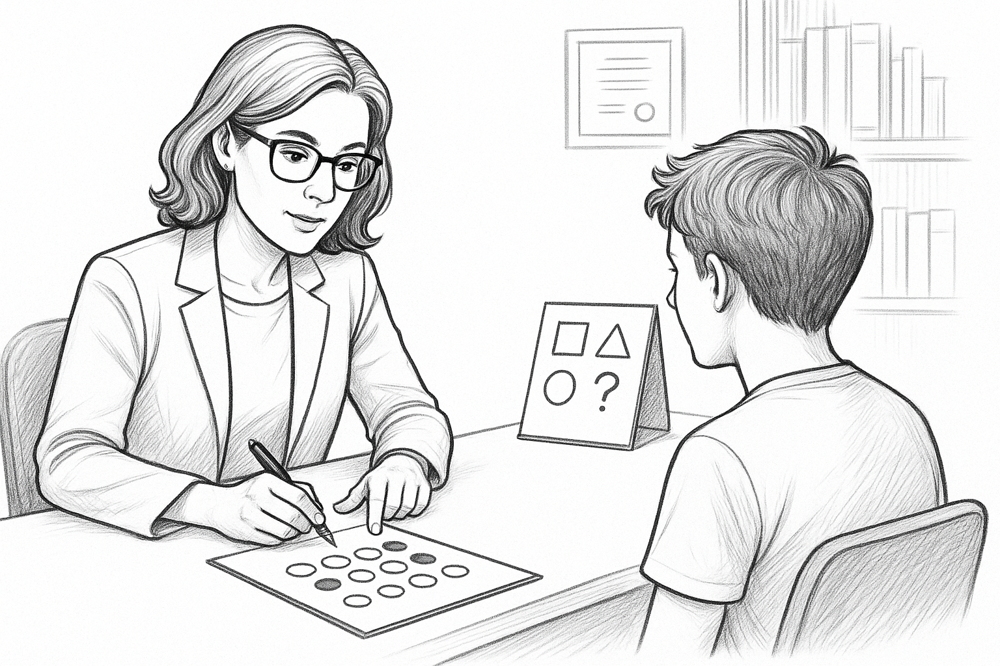

# Psicometria per la neuropsicologia clinica

## Valutazioni neuropsicologiche, test e misurazione: una riflessione iniziale
Quando si parla di "valutazione neuropsicologica", la prima cosa che viene in mente è certamente una persona che sta effettuando una serie di test per riuscire a comprendere lo stato cognitivo di un individuo. Lo scopo potrebbe essere l'accertamento sul sospetto di una patologia in corso (es. un sospetto di demenza), o la caratterizzazione di un disturbo cognitivo in una condizione accertata (es. capire se un trauma cranico ha avuto delle conseguenze). Le informazioni possono avere fini diagnostici, prognostici o riabilitativi.
Quello che accomuna tutti questi scenari è che difficilmente ci si potrebbe immaginare una valutazione neuropsicologica completamente senza test e, aggiungo, senza l'utilizzo di punteggi. 
Immaginiamo di voler descrivere a qualcuno che deve sottoporsi ad una valutazione neuropsicologica e che non sa ancora in cosa consiste, la risposta potrebbe essere qualcosa del tipo _" le verranno fatto alcune domande e verranno somministrate alcune prove, ad esempio ricordare una lista di parole, o fare altri semplici compiti. Alla fine tutte queste informazioni saranno utilizzate per capire come funziona la tua mente o, più precisamente, i suoi processi cognitivi."_
Provando a chiedere a ChatGPT4.0 la seguente cosa _Crea un disegno in bianco e nero di una neuropsicologa che sta effettuando una valutazione neuropsicologica_ il risultato che ho ottenuto (14/09/2025) è la figura qui di seguito.

{width=60%}

La figura (come siamo abituati adesso con questi sistemi di "Intelligenza Artificiale") è piuttosto accurata e quello che mostra è proprio una persona che somministra un **test**.

Tutta questa premessa (un po' ridondante), serve unicamente a chiarire che la neuropsicologia clinica è intrinsecamente legata alla somministrazione dei test sullo stato cognitivo, tanto che le cose sono spesso considerate inscindibili.  Non solo, la valutazione neuropsicologica fa praticamente sempre utilizzo di _punteggi_ dei test (cioè numeri) per trarre delle conclusioni. I punteggi sono confrontati con delle soglie e se i valori sono al di là di queste soglie, viene concluso che qualcosa probabilmente non va (useremo più avanti termini più tecnici e definizioni più precise). La persona con il punteggio al di là della soglia potrebbe avere un deficit cognitivo, o forse un rischio di avere una patologia neurodegenerativa. Va da sé, che se questa è di norma la pratica neuropsicologica clinica, come utilizziamo questi punteggi (cioè dei numeri), come li confrontiamo con queste soglie (chiamate "cut-off") è fondamentale perché rappresenta una parte fondante proprio della pratica clinica. Nel **prossimo paragrafo** vedremo come l'utilizzo di punteggi non è altro che un caso di _misurazione_ e che la _psicometria_ è la disciplina che si occupa di misurazione in psicologia (inclusa la neuropsicologia).

Immaginate di dover fare un esame del sangue per capire se avete qualche anomalia che potrebbe segnalare una patologia. Immaginate adesso di poter scegliere tra due centri: Il primo utilizza una nuova tecnologia all'avanguardia, che porta a risultati molto precisi. Il secondo utilizza invece una tecnologia degli anni 70, notoriamente imprecisa. Quale centro scegliereste?
Immagino che la scelta ricadrebbe sul centro con lo strumento più moderno e preciso. Ma complichiamo l'esempio: supponiamo adesso che sappiate che nel centro con lo strumento più moderno i tecnici e i medici che si occupano dello strumento non godano di una buona fama ed è noto non conoscano bene l'utilizzo di questo strumento innovativo. Immaginate inoltre, che nel centro con la tecnologia obsoleta il medico di riferimento sia un luminare, esperto della patologia che state indagando. Quale scegliereste? In questo caso la scelta è certamente più difficile. Ed è giusto che sia così: gli strumenti di misurazione non sono tutto e la capacità clinica, in questo caso del medico, va certamente considerata. Se non fosse altrimenti sceglieremmo principalmente sulla base dello strumento e non del medico.
Spero che però sia chiaro quale vuole essere il mio punto e l'analogia che voglio sottolineare: i test non sono certamente la sola cosa importante in una valutazione ma, _in quanto strumenti di misurazione_, possono essere più o meno precisi e possono essere usati più o meno correttamente. 
Immaginate i quattro scenari descritti nella tabella sotto che corrispondono a quattro centri clinici (A, B, C e D), Quale centro scegliereste?

|                                       | Strumento di valutazione   preciso | Strumento di valutazione  impreciso |
|:---------------------------------------:|:----------------------------------------------:|:-----------------------------------:|
| Personale clinico esperto             | Centro A                                     | Centro B                         |
| Personale clinico non esperto         | Centro C                                     | Centro D                          |

:Tabella 1.1: Quattro diversi centri clinici tra cui scegliere.

 
Penso che chiunque e senza dubbi, se potesse scegliere a parità di altre condizioni tra questi centri, sceglierebbe il Centro A. Ho usato questo stratagemma retorico per chiarire un principio di base e la sua motivazione: utilizzare strumenti precisi e utilizzarli bene è fondamentale, ma non è certamente tutto. Le competenze cliniche in alcuni casi possono anche sopperire in maniera importante eventuali carenze nell'utilizzo dei test e dei punteggi. A parità però di competenze cliniche, tutti sceglieremmo chi utilizza i test migliori e nella maniera più appropriata. 
È importante sottolineare che nell'esempio sopra non si parla soltanto di usare strumenti accurati, ma anche di _saperli usare correttamente_. Questo è un piccolo dettaglio con implicazioni molto importanti (e che saranno trattate ampiamente nel libro). Non si tratta solo di scegliere i test migliori, ma anche di usarli nella maniera più appropriata.
In sostanza, conoscere la psicometria e la statistica per chi fa neuropsicologia dovrebbe avere lo scopo finale di effettuare valutazioni migliori. Non voglio però suggerire che sia utile o importante fare confronti tra professioniste e professionisti in una sorta di competizione. Il confronto dovrebbe essere piuttosto con se stessi: poiché l'utilizzo dei test e misurazione sono così importanti nella neuropsicologia clinica, usare i test migliori e utilizzarli nel modo più corretto può essere la chiave per diventare diventare una _versione migliore di sè stessi, in quanto professionisti_. 

Queste considerazioni però aprono tanti altri quesiti a cui diventa importante rispondere. Come fare a capire quali test sono più precisi o, in generale, migliori per poterli utilizzare? Come utilizzare correttamente i numeri e le classificazioni che risultano dai risultati ai test? Risponderemo a tutte queste domande nel corso di questo libro.

## Misurazione e neuropsicologia clinica
Un aspetto spesso implicito nell'utilizzo dei risultati ai test neuropsicologici è quello di stare _misurando_ una proprietà del funzionamento mentale: tramite i test misuriamo la memoria, misuriamo l'attenzione, etc. Diventa pertanto necessario dare una definizione di cosa si intenda per _misurare_ e già qui sorgono i primi problemi: non esiste una definizione univoca di misurazione, unanimamente accettata (questa considerazione sarà proprio il punto di partenza del paragrafo [Introduzione all'Item Response Theory](#introduzione-item-response-theory)). Esistono però delle definizioni molto diffuse, specie in Psicologia, e che sono riportate in tutti i test. La più famosa è certamente quella di S.S. Stevens, che in un articolo del 1946 ha fornito una definizione che influenzato (nel bene e nel male) la storia della misurazione in psicologia:

_"...possiamo dire che la misurazione, nel senso piu ampio, è definita come l’assegnazione di numeri a oggetti o eventi secondo determinate regole.” (p. 667) _

La proposta di Stevens va contestualizzata al clima del momento. Alla fine degli anni 40 si stava discutendo (in ambito scientifico), se la gli oggetti di interesse della psicologia potessero essere misurati e se, quindi, la psicologia potesse essere considerata una scienza. L'iniziale conclusione di una commissione internazionale di fisici e psicologi che si era riunita per dare una risposta a questa domanda era arrivata alla conclusione che, secondo una definizione rigorosa di misurazione, la risposta era: no. 
Secondo Stevens però, il problema era proprio nei presupposti della commissione e, più in particolare, nella definizione troppo restrittiva di misurazione. Propose dunque la definizione riportata sopra, e sottolineò che anche se ogni regola porta a misurazione, un aspetto importante (ma separabile) è l'utilizzo che si può fare dei numeri o classificazioni che sono l'esito della misurazione e questo dipende dalla **Scala di Misurazione**. A seconda delle proprietà misurate (ma che possiamo sempre definire come una _misurazione_ potrebbe essere diverso l'utilizzo che possiamo fare dei numeri). Per esempio, il solo rilevare se una persona è femmina o maschio è, secondo la definizione di Stevens, un caso di misurazione e la scala utilizzale sarebbe una _scala categoriale_. In questo caso non hanno senso operazioni tipo addizione o sottrazione o moltiplicazione (non ha senso dire che una femmina è due volte un maschio o viceversa) e una delle poche operazioni possibili è contare quanti casi abbiamo per ogni categoria (es. confrontare il numero di femmine con il numero di maschi). Un riassunto delle scale e delle operazioni possibili è riportata nella tabella 1.2, che è un diretto adattamento della tabella di Stevens per la misurazione.

| Scala        | Descrizione                                                                 | Esempio                         | Operazioni possibili                                   |
|--------------|------------------------------------------------------------------------------|---------------------------------|--------------------------------------------------------|
| **Nominale** | Classificazione in categorie senza ordine implicito                         | Sesso (M/F), Colori, Nazionalità | Conteggio, moda, verifica uguaglianza/differenza      |
| **Ordinale** | Classificazione con ordine, ma senza distanze significative tra categorie   | Classifica di gara, Livello di istruzione (scuola) | Ordinamento, mediane, percentili                     |
| **Intervallo** | Misura con ordine e intervalli uguali, ma senza zero assoluto significativo | Temperatura in °C, IQ           | Addizione, Sottrazione,Media, Deviazione standard, z-score                |
| **Rapporto** | Misura con ordine, intervalli uguali e zero assoluto significativo           | Peso, Altezza, Età, Reddito     | Tutte le operazioni aritmetiche (×, ÷, +, −), z-score, rapporti|
**Legenda**  
- *Scala*: tipo di misura secondo la classificazione di Stevens.  
- *Descrizione*: caratteristiche principali della scala.  
- *Esempio*: variabili reali che rientrano in quella scala.  
- *Operazioni possibili*: trasformazioni matematiche e statistiche consentite dai dati.
:Tabella 1.2: Le quattro tipologie di scale di misurazione secondo S.S. Stevens.

Tutte queste considerazioni e queste scale potrebbero sembrare una complicazione eccessiva, un sofismo, e comunque di scarso impatto a livello di pratica clinica. Ma ciò non è vero. Facciamo un breve esempio. In neuropsicologia clinica è molto diffusa la pratica di ottenere punteggi "corretti" cioè punteggi a cui è tolto il contributo di età e scolarità, sesso e talvolta anche altre variabili.
L'ottenere una "correzione" presuppone che si possa "sottrarre" un contributo di età e scolarità al punteggio in modo che i valori siano comparibili questo ha senso solo se la scale è a misurata a livello di Scala ad Intervalli o Scala a Rapporti. Ad esempio, se il mio punteggio originale è 8, ma il contributo stimato di età, scolarità e sesso di un individuo è 3, per rimuoverlo devo sottrarlo e il punteggio corretto sarà `8-3=5`.
Di fatto, nella maggior parte dei test neuropsicologici _si assume_ che la misura sia su una Scala a intervalli o a rapporti, ma (come sarà ripreso nel paragrafo [**Misurare Cambiamenti nel  Tempo**](chapters/Appendici/Cambiamenti-nel-tempo.qmd#misurare_cambiamenti)).
Vorrei chiarire che il neuropsicologo (clinico o forense), non dovrebbe porsi quotidianamente il problema sulla scala di misurazione del test che sta usando, a meno che non decida di fare delle operazioni sui punteggi che non sono quelle normalmente previste per la pratica clinica e dal test stesso.

## I test
Già dall'introduzione è stato detto che il protoganista assoluto del libro è il test neuropsicologico. Ma cosa è un test? Come sempre, non possiamo non procedere senza fornire una definizione precisa che ci aiuti a definire cosa è un test (e cosa non lo è) e quali sono le caratteristiche che lo contraddistinguono.

### Test di prestazione tipica 

### Test di prestazione massima

### Alti test utili per la valutazione neuropsicologica
(Es. test di stima di riserva Criq, scale, etc.)

## Teoria Classica dei test

## Validità ed Affidabilità

### Tipi di Validità e perché sono importanti
#### Validità di costrutto
#### Validità concorrente
#### Validità predittiva
#### Validità interna
#### Validità di facciata
#### Validità ecologica

## Affidabilità

### Tipi di affidabilità e perché sono importanti
### Consistenza Interna
### Affidabilità Test Retest
### Affidabilità Split-Half
### Inter-Rater Agreement

## Introduzione alla _Item Response Theory_{#introduzione-item-response-theory}

## Nella pratica clinica: Come usare Affidabilità e Validità nella pratica clinica per scegliere i test

## Nella pratica clinica: Come usare Affidabilità e Validità per interpretare i test

## Errori comuni nel considerare gli aspetti psicometrici dei test.
